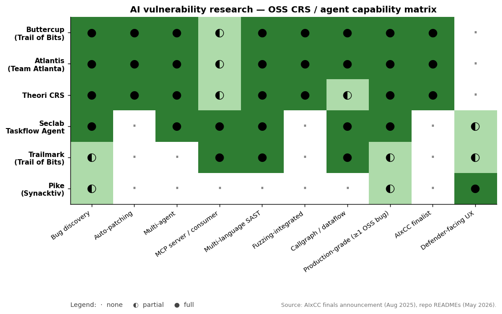

# AI vuln-research — Buttercup · Seclab Taskflow Agent

The most strategically important comparison in this report. Both repos are the *first generation of OSS AI vuln-finders that actually work*. They solve different problems:

| | Buttercup | Seclab Taskflow Agent |
|---|---|---|
| What it is | A Cyber Reasoning System (CRS) | A YAML-driven agent orchestration framework |
| Author | Trail of Bits | GitHub Security Lab |
| Origin | DARPA AIxCC Final (2nd place, $3M) | GitHub Security Lab internal tool |
| Form | Microservices on Kubernetes | Python CLI tool |
| Inputs | OSS-Fuzz-compatible C / Java projects | Anything you can YAML-describe |
| Output | Vulnerabilities + auto-generated patches | Whatever the agent does (vuln triage, code review, alert triage…) |
| Languages | Python (control) + C/C++/Java (targets) | Python |
| LLM providers | OpenAI / Anthropic / Google via LiteLLM | Chat Completions or Responses APIs (GitHub Models, OpenAI, anything OpenAI-Agents-SDK-compatible) |
| Code size in submodule | 13 MB, 96 files | 940 KB, 44 files |

The asymmetry of size is informative: Buttercup is a **fully deployed system**, Taskflow Agent is a **framework you stand up workflows on**.

## How the AI vuln-research OSS lineup compares



The matrix extends the table above to the full 2025–2026 OSS lineup and surfaces three useful observations:

1. **The AIxCC trio (Buttercup / Atlantis / Theori) are nearly identical in capability** — same CRS shape, same bug-discovery + auto-patching + multi-agent + fuzzing-integrated stack. Practical differentiation is in deployment ergonomics and language-target coverage, not headline features. If you need to pick one, pick whichever ships the cleanest "developer-laptop" experience for the languages you care about.
2. **Taskflow Agent and Trailmark are the framework-first picks.** Neither does auto-patching (Taskflow can if you wire it; Trailmark is read-only callgraph + semantic graph), and neither was an AIxCC finalist. They're the OSS substrate the *next* generation of CRSs will be built on — including by GitHub Security Lab itself.
3. **Pike is the outlier** — pure analyst-facing chat UI over Linux `strace` recordings, not a CRS at all. Included to show that "AI vuln research" is a broader category than "build the next AIxCC entry."

The columns to bias on for selection are **MCP server / consumer** (every CRS will need it for IDE integration), **callgraph / dataflow** (the differentiator that decides false-positive rate), and **defender-facing UX** (the bottleneck for adoption beyond research labs).

---

## Buttercup — the "complete CRS" approach

The AIxCC competition required teams to build an end-to-end **find-and-patch** pipeline. Buttercup's architecture from its `CLAUDE.md`:

> **Components**: Orchestrator, Seed Generator, Fuzzer, Program Model, Patcher

> **Data flow**: Competition API → Task Server → Task Downloader → Program Model indexes code → Build Bot compiles fuzzing harnesses → Fuzzer Bot executes tests, Coverage/Tracer Bots monitor → Seed-gen creates targeted inputs → Patcher generates/validates fixes → Results submitted back

This is a *complete* vulnerability lifecycle in a single repo:

| Stage | Component | What's actually novel |
|---|---|---|
| Code ingestion | program-model | Builds a **CodeQuery + Tree-sitter** semantic index of the target. Tree-sitter for AST, CodeQuery for queryable semantic graphs. Same idea Trailmark uses standalone. |
| Build | fuzzer/build-bot | Reuses OSS-Fuzz's container model; builds the project's existing fuzzing harnesses (not creating new ones — leveraging upstream OSS-Fuzz harnesses). |
| Fuzzing | fuzzer/fuzzer-bot, coverage-bot, tracer-bot | Standard libFuzzer + AFL++. **The novelty is what feeds it.** |
| Seed generation | seed-gen | LLM proposes inputs that are likely to exercise specific code paths. Coverage feedback informs which paths to target next. |
| Vulnerability analysis | (in patcher) | LLM examines crash + code context to classify the bug and identify the root cause. |
| Patch generation | patcher | **Multi-agent** LLM patcher: one agent proposes a patch, another validates it against the fuzz corpus, regression suite, and the original crash. Iterates until the patch passes all gates. |
| Orchestration | orchestrator | Redis-backed reliable queues + protobuf messages between services. Standard distributed-systems plumbing. |
| Observability | (all) | OpenTelemetry tracing, Langfuse for LLM cost/trace tracking, SigNoz UI. |

### What's actually novel in Buttercup

1. **Runs on a developer laptop.** Min spec: 8 CPU / 16 GB / 100 GB. Trail of Bits explicitly designed this as a usable artifact, not just a competition submission. Most CRS prototypes require cluster-scale resources; Buttercup is k3d/k8s-on-localhost.
2. **Cost-efficient on AIxCC scoring** — second-place finish at **$181/point** (28 bugs, 20 CWEs, 90% accuracy) using **exclusively non-reasoning LLMs**. This is the most concrete data point we have on what "AI vuln research" costs to operate.
3. **Multi-agent patching is the differentiator** — not the fuzzer. Other CRSs found similar bugs; Buttercup's patch quality (passes both regression and the discovered-crash test) is what scored.
4. **OSS-Fuzz native** — works against existing OSS-Fuzz projects without re-instrumentation. This is the only reason it can ingest real-world Java + C codebases without massive per-target setup.
5. **Architecture is the artifact** — Trail of Bits' announcement was less "look at the model we trained" and more "look at the pipeline we shipped." The repository is deployable; you can `make deploy` and `make send-libpng-task` and watch it find and patch a known libpng bug live.

### What Buttercup is *not*

- Not a SAST replacement. It needs a build harness (fuzzing entrypoint) per target.
- Not a 0-click scanner. The OSS-Fuzz harness requirement excludes most non-OSS internal codebases.
- Not free to operate — Trail of Bits explicitly warns about LLM costs in the README and integrates a budget cap.
- Not aware of authorization-style bugs (BOLA/BFLA). Those need API context, not fuzzing.

---

## Seclab Taskflow Agent — the "framework, not pipeline" approach

Where Buttercup ships a *system*, Taskflow Agent ships a **grammar**. The same `CLAUDE.md`-style architecture diagram from its README:

```
CLI → Runner (taskflow execution loop)
    → MCP Lifecycle (server connection / cleanup)
    → Agent (TaskAgent wrapper, OpenAI Agents SDK bridge)
```

The novelty is the **YAML grammar** that lets a non-Python user author multi-agent workflows. Five file types:

| filetype | What it defines | Example use |
|---|---|---|
| `personality` | System-prompt characterization of a single agent | `c_auditer`, `fruit_expert`, `assistant` |
| `toolbox` | An MCP server configuration | CodeQL MCP, memcache MCP, GitHub MCP, custom MCP |
| `taskflow` | A sequence of tasks (each with agents, prompts, tools, env) | The actual "do this" recipe |
| `prompt` | A reusable prompt snippet | Included with Jinja `` |
| `model_config` | Model name → API endpoint mapping | Lets you swap models per-task |

Each task in a taskflow can specify:
- `model`, `max_steps`, `must_complete`
- `agents` (primary + handoff agents — using OpenAI Agents SDK's [handoff](https://openai.github.io/openai-agents-python/handoffs/) feature)
- `user_prompt` (Jinja-rendered)
- `env` (temporary env vars, including templated `{{ env('VAR') }}`)
- `toolboxes` (overrides personality's default)
- `run` (run a shell script, e.g., to emit JSON for `repeat_prompt` iteration)
- `repeat_prompt` (templated iteration over previous task's output)

### What's actually novel in Taskflow Agent

1. **YAML-as-Python-package** — taskflows / personalities / toolboxes use dotted-path imports resolved via `importlib.resources.files`. So `seclab_taskflow_agent.personalities.c_auditer` is a YAML file inside a Python package. This means **you ship taskflows as PyPI packages**. Reusable security workflows become installable.
2. **CodeQL MCP server included** — not "use CodeQL," but **"CodeQL is a tool the agent calls."** Templated CodeQL queries become MCP tools, and the agent navigates code via those queries. This is the inverse of "agent writes CodeQL queries" — instead, *humans* author templated queries and the agent uses them as a structured navigation API. See [`CVE-2023-2283.yaml`](https://github.com/GitHubSecurityLab/seclab-taskflow-agent/blob/main/examples/taskflows/CVE-2023-2283.yaml) + the [demo video](https://www.youtube.com/watch?v=eRSPSVW8RMo).
3. **Session checkpoint / resume** — every task is checkpointed. If a task fails 3 times, the session is saved and resumable with `--resume <session-id>`. Critical for long-running audits.
4. **Confirm gates per tool** — toolbox YAML can mark specific tool calls as requiring user confirmation. Pair with `headless: true` to auto-allow on uninteresting tasks while still gating dangerous ones.
5. **MCP environment denylist** — `TASKFLOW_ENV_DENYLIST` prevents secrets from leaking into MCP server subprocesses by default. Toolbox-level `env:` declarations are explicit allowlist.
6. **Tasks can run shell** — `run: |` blocks emit JSON output that the next task can iterate over with `repeat_prompt: true`. This is the loop primitive missing from most agent frameworks.

### What Taskflow Agent is *not*

- Not a vuln finder out of the box — you build taskflows that find vulns.
- Not Buttercup. No fuzzing layer, no patch generator.
- Not multi-target — designed for single-task agentic workflows, not orchestrating across thousands of repos.
- Tied to OpenAI Agents SDK semantics (handoffs, agent loops) — moving to a different agent runtime would be a substantial rewrite.

---

## Side-by-side: when to use which

| Scenario | Use | Why |
|---|---|---|
| You want to find + patch a memory-safety bug in an OSS-Fuzz-compatible codebase | Buttercup | End-to-end loop with auto-patching is unique. |
| You want to scale automated vuln discovery across hundreds of OSS projects | Buttercup (with budget cap) | Already proved this on AIxCC; designed for batch. |
| You want to audit your own internal codebase for a specific vulnerability class | Taskflow Agent + CodeQL MCP | Compose CodeQL queries + LLM reasoning into a taskflow. |
| You want to triage existing scanner findings (Dependabot, CodeQL alerts) | Taskflow Agent | Designed for this — GHSL uses it internally for code-scanning alert triage. |
| You want to integrate AI into a CI/CD security gate | Taskflow Agent (easier) or Buttercup (heavier) | Taskflow Agent runs as a CLI; Buttercup runs as a k8s service. |
| You want to build a custom CRS for your own competition / research | LibAFL + Taskflow Agent (composed) | The two abstractions are complementary: LibAFL for fuzzing primitives, Taskflow Agent for LLM orchestration. |

## What this means strategically

**These are not redundant tools.** They occupy different layers:

```
                            ┌─────────────────────────────────┐
                            │   Your security program          │
                            └─────────────────┬───────────────┘
                                              │
                ┌─────────────────────────────┼─────────────────────────────┐
                │                             │                             │
       ┌────────▼─────────┐         ┌────────▼─────────┐         ┌────────▼─────────┐
       │  Buttercup       │         │  Taskflow Agent  │         │  Manual review   │
       │  (heavy, OSS-    │         │  (custom         │         │  (irreplaceable) │
       │   Fuzz-shape     │         │   workflows)     │         │                   │
       │   bugs)          │         │                  │         │                   │
       └──────────────────┘         └──────────────────┘         └───────────────────┘
```

The right strategy in 2026 is to **deploy both**: Buttercup as a batch CRS against OSS dependencies + your own fuzzable internal services; Taskflow Agent for everything else (CodeQL alert triage, code review of high-risk PRs, IaC review, agent-driven IR runbooks). The two repos are at the OSS frontier of what's deployable; expect them to merge conceptually as the OpenAI Agents SDK matures and Buttercup's components get more agent-shaped.
