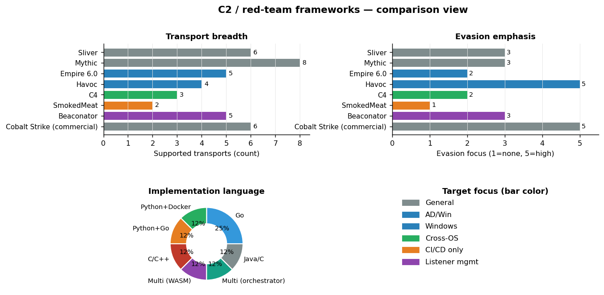

# C2 / red-team frameworks — landscape comparison

Brief landscape comparison of the OSS C2 / red-team frameworks active in 2025–2026, plus where the 2026 specialized entrants (notably **SmokedMeat**) sit relative to the general-purpose stack.

Unlike most categories in this brief, this one has **no single submodule** to deep-dive on — the existing tools are too numerous to mirror and the meaningful comparisons are about *positioning*, not internal code. This report is the landscape view.

For the CI/CD-specialized SmokedMeat deep-dive, see [`ci-cd-security.md`](./ci-cd-security.md).

---

## Side-by-side comparison

Three sub-views in one figure:

1. **Transport breadth** — Mythic leads at 8 supported transports (HTTP, HTTPS, DNS, SMB, TCP, WebSocket, Discord, file-based). Sliver, Beaconator, and Cobalt Strike cluster around 5–6. SmokedMeat is intentionally narrow (2: HTTP + WebSocket) because its target is just the GitHub Actions runner.
2. **Evasion emphasis** — Havoc and the commercial Cobalt Strike top the rating (5/5); Sliver and Mythic sit mid-range (3/5); SmokedMeat is deliberately the floor (1/5) per the README's *"This isn't an EDR evasion tool"* framing.
3. **Implementation language** — Go is the modal choice (Sliver, SmokedMeat). The diversity reflects the post-Cobalt-Strike fragmentation: every team builds the framework in the language they're comfortable with.

The color coding shows **target focus**: most frameworks are "general-purpose" (gray), but the category is **specializing**:
- **Empire 6.0 / Havoc** → Windows / AD focus.
- **C4** → cross-OS specifically (WASM plugins).
- **SmokedMeat** → CI/CD only.
- **Beaconator** → listener/payload management only (not a full framework).

The strategic read: 2026 is when "C2 framework" stops being a monolithic category and becomes **a portfolio of specialists**. A 2026 red-team operator runs Sliver or Mythic as the general-purpose backbone, then layers SmokedMeat for pipeline work, BOAZ for evasion-heavy engagements, and Empire 6.0 for AD-centric jobs.

---

## What's in this brief vs. what's elsewhere

Already covered in depth elsewhere in this brief:

- **SmokedMeat** — [`ci-cd-security.md`](./ci-cd-security.md). The 2026 CI/CD-specialized framework.
- **Empire 6.0** — indexed in [`TOOLS.md`](../TOOLS.md). Go-agent rewrite + module marketplace.
- **C4 / Beaconator / GlytchC2 / BOAZ / WarHead / Messenger / Blackdagger / AIMaL** — DEF CON 33 Demo Labs releases, indexed in [`TOOLS.md`](../TOOLS.md) and [`conferences/defcon-33.md`](../conferences/defcon-33.md).

Background context worth knowing:

- **Sliver** (`BishopFox/sliver`) — the canonical OSS Go-based C2; influenced SmokedMeat's C2 architecture.
- **Mythic** (`its-a-feature/Mythic`) — the OSS Cobalt Strike alternative with the deepest plugin ecosystem. SmokedMeat borrows its multi-operator collaboration model.
- **Havoc** (`HavocFramework/Havoc`) — evasion-heavy modern OSS C2; the option you reach for when EDR is the constraint.
- **Cobalt Strike** — commercial; included in the chart for reference because it's the implicit benchmark every OSS framework competes against.

---

## Cross-references

- The post-engagement OSS pipeline (Praetorian / Trail of Bits / Boost / Doyensec / GitHub Sec Lab) that's driving most of the 2026 *non-C2* OSS releases — see [`landscape-analysis.md`](./landscape-analysis.md) §4.
- The "9 tools shipped, but most are tiny and narrowly-focused" pattern is visible in the [category distribution chart](../assets/landscape/02-categories.png) — C2 leads on count but trails on per-tool depth.
- The C2 category is **the only one in the inventory that's 100% offensive** (see [offense/defense balance](../assets/landscape/07-offense-defense.png)). No defensive equivalents ship under "C2" — defense lives in EDR, Falco, Tetragon, and detection engineering, which sit in different categories.
