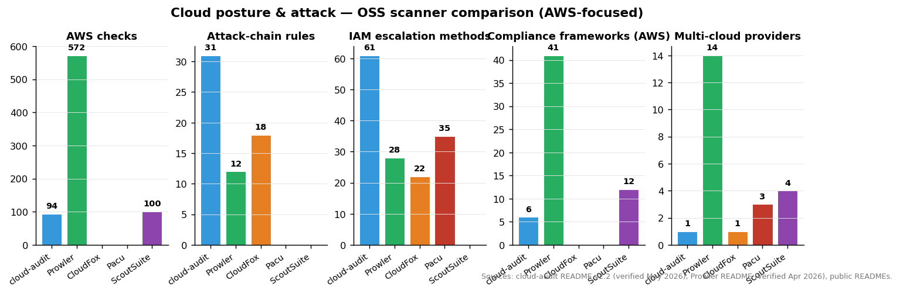

# Cloud posture — cloud-audit (vs Prowler)

A single submodule tool ([`sources/cloud/cloud-audit`](../sources/cloud/cloud-audit)) covering a narrow but operationally distinct slice of cloud posture: **opinionated AWS-only scanner that ranks fixes by attack-chain impact and ships reviewable Terraform/AWS-CLI remediation for every finding**.

Prowler is the elephant in the room — 572 checks across 83 AWS services, multi-cloud, the de-facto OSS standard. Cloud-audit's wedge is the *opposite* of breadth: 94 curated AWS-only checks, with the analytical layer (attack-chain correlation, IAM escalation graph, what-if simulator, trend tracking) built into the free CLI rather than into a separate web app like Prowler's.

This report covers what cloud-audit does that Prowler doesn't, when each is the right pick, and what's coming.

---

## What cloud-audit is

**Repo:** `gebalamariusz/cloud-audit` · License: **MIT** · Python 3.12+. Author: Mariusz Gebala / HAIT. v2.2 (May 2026) is the snapshot pinned in the submodule.

A pip-installable CLI:

```bash
pip install cloud-audit
cloud-audit scan
cloud-audit demo   # try without an AWS account
```

94 checks across 23 services: IAM, S3, EC2, VPC, RDS, EIP, EFS, CloudTrail, GuardDuty, KMS, CloudWatch, Lambda, ECS, SSM, Secrets Manager, AWS Config, Security Hub, Account, AWS Backup, Amazon Inspector, AWS WAF, Amazon Bedrock, Amazon SageMaker. Read-only — needs only the AWS-managed `SecurityAudit` policy.

### What's genuinely novel

1. **Attack-chain correlation in the CLI (31 rules).** The headline feature. Cloud-audit doesn't just list findings; it correlates them into **exploitable attack paths** ranked by MITRE ATT&CK Cloud taxonomy:

   | Chain | Components correlated |
   |---|---|
   | Internet-Exposed Admin | Public SG + admin IAM role + IMDSv1 |
   | IAM Privilege Escalation | `iam:PassRole` + `lambda:CreateFunction` + `iam:AttachRolePolicy` → admin in 3 steps |
   | CI/CD to Admin Takeover | OIDC trust policy without `sub` condition + admin policy → pipeline hijack |
   | LLMjacking | Bedrock invocation without logging + no guardrails → undetected model abuse |

   The rule set is **inspired by Datadog's [pathfinding.cloud](https://github.com/DataDog/pathfinding.cloud)** but lives in the CLI rather than a separate graph database. The full chain catalog is at [haitmg.pl/cloud-audit/features/attack-chains/](https://haitmg.pl/cloud-audit/features/attack-chains/).

2. **IAM privilege escalation graph (61 methods).** This is the **open-source replacement for [PMapper](https://github.com/nccgroup/PMapper)**, which has been effectively dead since 2022. Cloud-audit covers **9 categories** of escalation: action-based (the classic PMapper coverage) plus **AssumeRole lateral movement via cross-account / cross-service trust graph traversal** — paths PMapper never modeled. 61 methods × 9 categories runs locally with no graph DB required.

3. **What-If simulator.** `cloud-audit simulate --fix aws-vpc-002` shows the **score delta**, **chains broken**, and **findings resolved** before you apply anything. Multi-fix simulation works too:
   ```
   cloud-audit simulate --fix aws-vpc-002,aws-ct-001,aws-iam-007
   # Score: 34 -> 82 (+48)  |  Chains broken: 19 of 22
   ```
   This is the simulator equivalent of `terraform plan` — runs locally against the scan data, doesn't touch AWS APIs.

4. **Root-cause grouping with chain-breaking ranking.** *"Fix 4 things, break 22 chains."* The remediation plan groups findings by **shared root cause** and ranks fixes by how many attack paths each one collapses. This is the prioritization layer most scanners punt to the operator.

5. **Threat Feed (v2.2 new).** 10 active-abuse patterns tracked against 2025–2026 incidents — cryptomining campaigns, SES phishing setup, leaked-credential scanner activity, AgentCore CVEs. Each pattern carries **external research references** (Wiz, Datadog Security Labs, Unit 42, Permiso) attached to every finding. Exit code 1 on CRITICAL/HIGH for CI gating.
   ```bash
   cloud-audit threat-feed              # all 10
   cloud-audit threat-feed --list
   cloud-audit threat-feed --pattern aws-tf-003
   ```

6. **Reviewable remediation, not auto-fix.** 94/94 findings ship with both **AWS CLI commands** and **Terraform HCL snippets**, each linked to AWS documentation. `--export-fixes fixes.sh` writes everything to a `set -e` bash script with commented blocks — operator reviews, uncomments, runs. This is intentionally different from Prowler's 55 in-place fixers (direct API calls) — the design choice is "you read the change before it ships."

7. **Built-in scan diff + trend tracking.** `cloud-audit diff yesterday.json today.json` catches **ClickOps drift** (someone changed something in the console). `cloud-audit trend` renders posture-over-time with sparkline. No external time-series DB — JSON files on disk are the system of record. Most scanners punt this to Splunk / DataDog / Wiz; here it's a CLI command.

8. **AI-SPM checks.** First **open-source Bedrock + SageMaker security scanner**: 5 checks + 3 attack-chain rules covering model theft, LLMjacking, and data poisoning. This is the OSS equivalent of what Snyk's "AI Security Fabric" and Wiz "AI-SPM" sell as premium features.

9. **MCP server (free).** 6 tools: `scan_aws`, `get_findings`, `get_attack_chains`, `get_remediation`, `get_health_score`, `list_checks`. Installs with `claude mcp add cloud-audit -- uvx --from cloud-audit cloud-audit-mcp`. Same pattern as [Trivy MCP](../sources/appsec/trivy-mcp) — wrap your CLI for agent callability.

10. **Breach cost estimation.** Every finding and every chain carries a **dollar-range risk estimate** sourced from IBM and Verizon breach data, with citations. Useful for "should we prioritize this?" board conversations.

11. **6 compliance frameworks.** CIS AWS v3.0 (55/62 automated, 89%), SOC 2 Type II (24/43, 56%), plus BSI C5:2020, ISO 27001:2022, HIPAA Security Rule, NIS2 (all beta).

### Output formats

| Format | Use |
|---|---|
| `--format html` | Client-ready report |
| `--format json` | Machine-readable / scan diff |
| `--format sarif` | GitHub Code Scanning tab |
| `--format markdown` | PR comments |

---

## How it compares to other AWS-focused scanners



The chart makes the **complementarity story** measurable:

- **AWS checks (breadth):** Prowler 6× cloud-audit. If your single requirement is "scan every AWS service," Prowler wins.
- **Attack-chain rules (depth):** cloud-audit 2.6× Prowler. If your requirement is "rank findings by exploitability," cloud-audit wins.
- **IAM escalation methods:** cloud-audit 61 vs Prowler 28 vs Pacu 35. cloud-audit is the leader specifically because it's the **PMapper successor** (PMapper effectively dead since 2022).
- **Compliance frameworks:** Prowler 6.8× cloud-audit. If you need PCI-DSS / FedRAMP / GDPR evidence, Prowler wins.
- **Multi-cloud:** Prowler 14 providers vs cloud-audit 1 (AWS only). For non-AWS shops, cloud-audit is irrelevant; for AWS-heavy shops, breadth doesn't matter.

The numerical picture supports the "Prowler quarterly + cloud-audit daily" pattern that's emerging in 2026 AWS sec practice.

## How it compares to Prowler

Prowler is **the AWS security standard**: 572 checks, 41 compliance frameworks (CIS, PCI-DSS, HIPAA, SOC2, NIST 800, ISO 27001, GDPR, FedRAMP, NIS2, MITRE ATT&CK, …), 55 auto-remediation fixers, graph-based attack analysis in the Prowler App (Cartography + Neo4j), and multi-cloud coverage spanning Azure, GCP, K8s, M365, and 10+ providers. The cloud-audit README is unusually honest about this.

| Feature | Prowler | cloud-audit |
|---|---|---|
| AWS checks | 572 across 83 services | 94 across 23 services |
| Compliance (AWS) | 41 frameworks | 6 frameworks |
| Auto-remediation | 55 fixers (direct API calls) | 94/94 with CLI + Terraform output (reviewable, you apply) |
| Attack path / graph | Prowler App (Cartography + Neo4j) | CLI-native (31 rules, zero infra) |
| IAM privesc graph | Prowler App | CLI-native (61 methods + AssumeRole graph) |
| What-If simulator | No | Yes |
| AI/ML checks | ~20 | 5 + 3 chain rules |
| Scan diff / drift | Prowler App | Built-in CLI |
| Breach cost (USD) | No | Per-finding + per-chain |
| MCP Server | Free | Free |
| Multi-cloud | AWS + 13 others | AWS only |
| License | Apache 2.0 | MIT |

The right framing is **complementary, not competitive**:

- **Use Prowler** for compliance breadth (PCI-DSS, FedRAMP, GDPR coverage), multi-cloud (Azure/GCP/M365), and graph-based attack path analysis when you can stand up Cartography + Neo4j.
- **Use cloud-audit** for fast CLI-native attack-chain detection, reviewable Terraform remediation, AWS-only deep-dive, and CI/CD drift tracking without infrastructure.

The most common deployment that surfaces in the AWS sec community in 2026 is: **Prowler quarterly for compliance evidence, cloud-audit daily in CI/CD**.

---

## Strategic positioning

Cloud-audit fits into the strategy-session picture as the **"opinionated minimum-viable AWS posture tool that gives a small team something actionable in 10 minutes."** Prowler is intimidating; cloud-audit is `pip install` + read the chains + apply the highest-impact fix first.

For the same reason, it's a **natural pairing with SmokedMeat + Brutus from [`ci-cd-security.md`](./ci-cd-security.md)**:
- SmokedMeat compromises a CI/CD pipeline and pivots to AWS via OIDC.
- The chain it exploits — "OIDC trust without `sub` condition + admin policy" — is **exactly chain `aws-ct-001`-class** in cloud-audit.
- Cloud-audit's chain detection plus the what-if simulator gives you a defensive feedback loop on the same attack class SmokedMeat is exercising.

Other 2025–2026 OSS cloud-posture tools worth knowing about (not mirrored here, but adjacent):

- **[Prowler](https://github.com/prowler-cloud/prowler)** — the standard, covered above.
- **[Pacu](https://github.com/RhinoSecurityLabs/pacu)** — AWS exploitation framework. Pacu is to cloud-audit what SmokedMeat is to Plumber: same attack class, opposite side of the fence.
- **[CloudFox / CloudFoxable](https://github.com/BishopFox/cloudfox)** — Bishop Fox's situational-awareness toolkit. Indexed in `TOOLS.md`.
- **[KIEMPossible](https://github.com/PaloAltoNetworks/KIEMPossible)** — Palo Alto's entitlement-management scanner. Indexed in `TOOLS.md`.
- **[ScubaGear](https://github.com/cisagov/ScubaGear)** / **[ScubaGoggles](https://github.com/cisagov/ScubaGoggles)** — CISA's M365 / Google Workspace baseline scanners.
- **[Datadog pathfinding.cloud](https://github.com/DataDog/pathfinding.cloud)** — the academic underpinning that inspired the attack-chain rule layer in cloud-audit.

## Where the category is going

1. **The "scanner + simulator + remediation generator" pattern is the new shape of cloud posture.** Cloud-audit is the first OSS tool to ship all three in a single CLI. Prowler's roadmap has a similar direction (the App tier is moving that way) but the OSS-friendly version lives in cloud-audit today.

2. **AI-SPM is the new compliance line item.** Bedrock + SageMaker dedicated checks are no longer a "nice to have." Snyk, Wiz, and Lacework all shipped commercial AI-SPM in early 2026; cloud-audit is the OSS counterweight.

3. **PMapper's death created an open opportunity, and cloud-audit took it.** The 61-method IAM escalation engine is the closest OSS replacement on offer. Expect Praetorian, Bishop Fox, or NCC to ship competing graphs in the next 12 months.

4. **Multi-cloud will come last, not first.** Cloud-audit will stay AWS-only for at least the next two minor versions per the roadmap — multi-account scanning (AWS Organizations), SCP + permission boundary evaluation, and Terraform drift detection are the next priorities. The right framing: don't expect cloud-audit to become Prowler. Expect it to keep being "the opinionated AWS-only one with the simulator."
