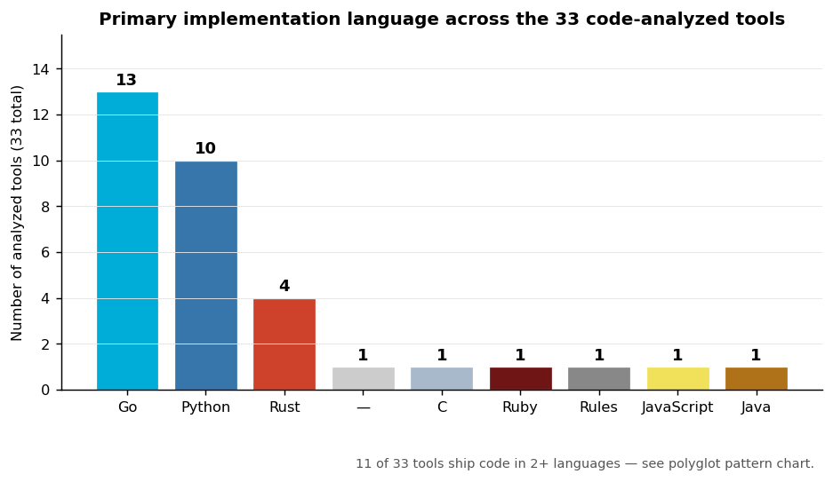
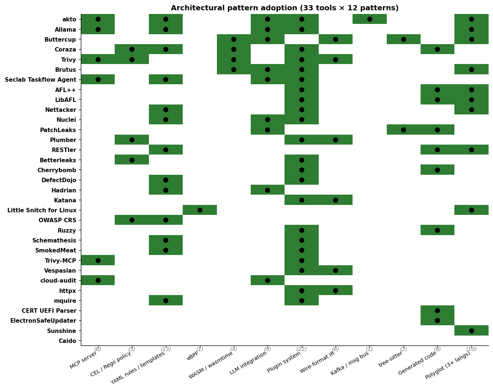
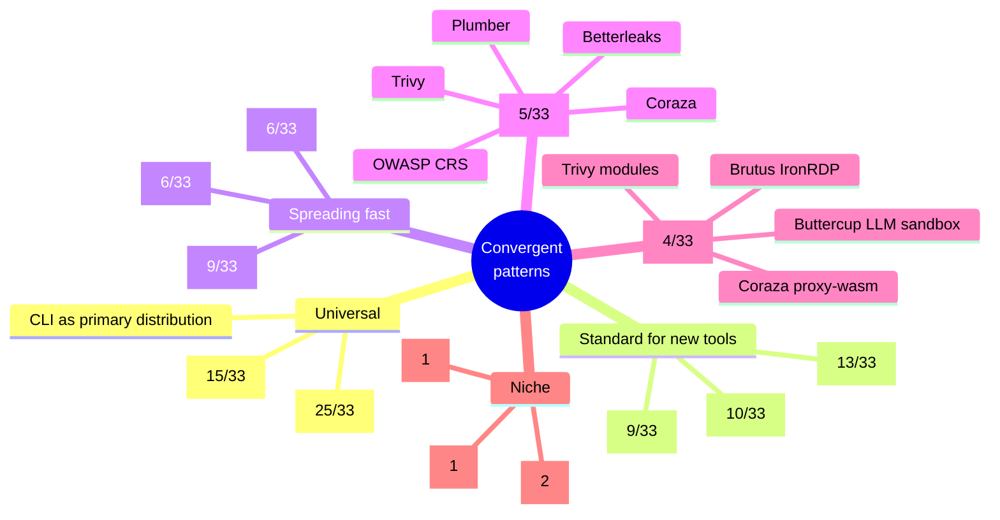
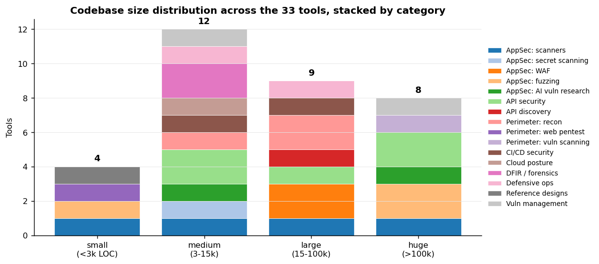
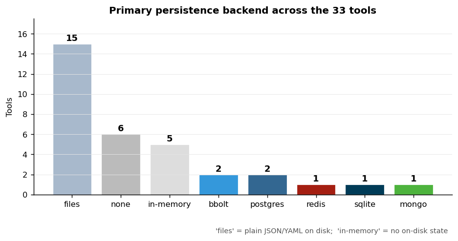
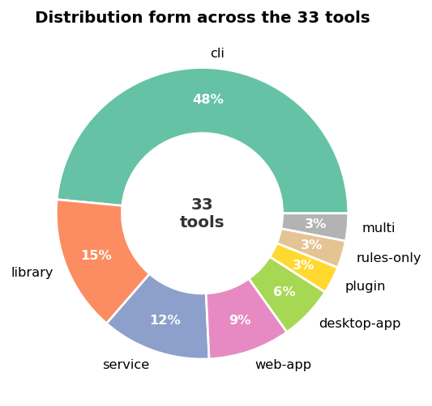
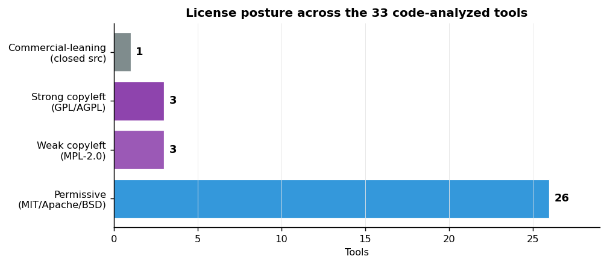
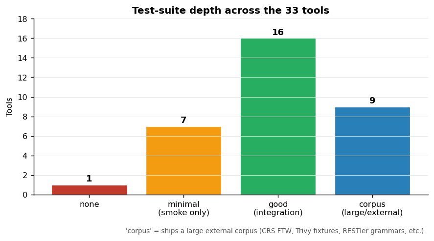
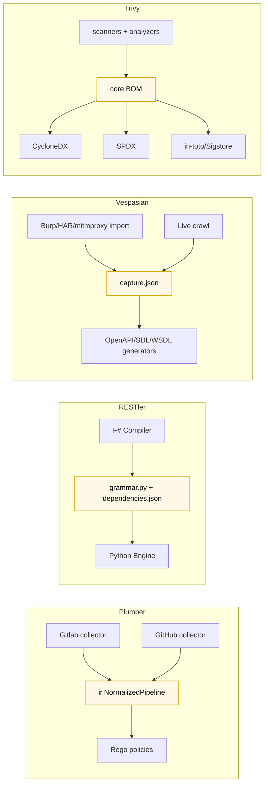

# Code-level landscape analysis

Cross-cutting analytics over the **33 code analyses** under [`reports/code/`](.) — what the source actually tells us about how 2026 OSS security tooling is built.

This report sits on top of the individual reports; if you want a per-tool deep-dive, see [`README.md`](./README.md) for the index. Charts are generated by [`assets/landscape/generate_code_analysis.py`](../../assets/landscape/generate_code_analysis.py); the curated inventory at the top of that script is the source of truth.

---

## TL;DR

1. **Go and Python own the field** (13 + 10 of 33 tools). Rust is a credible third (4); everything else is single-digit.
2. **Plugin systems are nearly universal** (25 of 33). YAML-based rules/templates are the second most common pattern (13 of 33). MCP-server adoption stands at 6 of 33 — *and growing fast*.
3. **Most security tools are stateless** — 15 of 33 store everything in plain files on disk; only 7 use a real database. Heavy state lives where you expect it: vuln-management (DefectDojo postgres), API-security (akto mongo), SOAR (Allama postgres+temporal).
4. **Permissive licensing is dominant** (24 of 33). Strong copyleft (GPL/AGPL) is a deliberate, recent strategic choice — SmokedMeat, Allama, Little Snitch.
5. **Test depth bifurcates sharply** — 9 tools ship excellent test corpora (CRS, Trivy, AFL++, Coraza, DefectDojo, LibAFL, Nuclei, RESTler, Schemathesis); 9 ship minimal or none. The middle ("good integration tests") is smaller than either tail.
6. **Polyglot 3+-language repos are now common** — 10 of 33. Almost always driven by an AI/agent layer added to a single-language core (akto: Java+Go+Python+TS+Lua; Allama: Python+TS; Buttercup: Python+wasmtime).
7. **At least 6 concrete code-quality issues** surfaced during the reviews — see §10. Worth tracking before integrating any of these tools.

---

## 1. Language distribution

Read with the polyglot pattern in §3: 11 of the 33 tools ship code in 2+ languages, so the "primary" label is a simplification. Go dominates the perimeter / CI/CD / scanner space (ProjectDiscovery, Praetorian, Aqua, Boost). Python dominates AI vuln-research and orchestration. Rust is concentrated in DFIR and fuzzer-framework slots (mquire, LibAFL, Little Snitch, Cherrybomb).

The "—" entry is Caido (closed source — public repo is brand assets + issue templates only, per [`caido.md`](./caido.md)).

---

## 2. Architectural pattern adoption

The single most informative chart in this brief — 33 tools × 12 patterns:

Pattern-frequency table (parenthesised counts under the chart):

| Pattern | # tools | Notes |
|---|---:|---|
| **Plugin system** | 25 | Near-universal. Implementations range from Go `init()` registries to Python `importlib`-by-convention to Lua hooks. |
| **YAML rules / templates** | 13 | The de-facto security-tooling DSL. Capability varies wildly: from declarative-only (CRS, Schemathesis config) to runtime-`eval()`-arbitrary-Python (Nettacker `dependent_on_temp_event`). |
| **Polyglot (3+ langs)** | 10 | Almost always driven by an AI/agent layer pulling in ML libraries that don't fit the core language. akto leads at 5 languages. |
| **LLM integration** | 9 | Becoming a baseline expectation. Patterns: as oracle (Semgrep), as planner (Hadrian), as peer-of-fuzzer (Buttercup), as enrichment (Allama), as backend swap (PatchLeaks). |
| **Generated code** | 9 | Codegen as a build step or runtime artifact. Includes RESTler (`grammar.py`), Cherrybomb (Rust derive), AFL++ (LLVM passes), LibAFL (`include_bytes!`-embedded cdylib), ESU (signature generator). |
| **Wire-format IR** | 6 | Serialised intermediate between processing stages. Plumber `ir.NormalizedPipeline`, RESTler `grammar.py`, Vespasian `capture.json`, Trivy `core.BOM`, Katana `navigation.Response`, httpx `Result`. |
| **MCP server** | 6 | 0% in 2025; ~18% of analyzed tools in mid-2026. Trivy MCP, Trivy proper, cloud-audit, Allama (consumer), Seclab Taskflow Agent, akto. |
| **CEL / Rego policy** | 5 | Declarative expression engine. Plumber + OWASP CRS use Rego; Betterleaks + Coraza + Trivy use CEL or CEL-shaped DSLs. |
| **WASM / wasmtime** | 4 | Trivy (analyzer plugin), Brutus (IronRDP), Coraza (proxy-wasm target), Buttercup (sandboxed LLM Python). |
| **tree-sitter** | 2 | PatchLeaks (11 grammars) + Buttercup (multi-language Code-Query backend). |
| **eBPF** | 1 | Little Snitch for Linux only. Reflects that eBPF is host-defense; rest of the inventory is offensive/scanning. |
| **Kafka / msg bus** | 1 | akto only. Reflects that most OSS security tools are still single-process or per-host. |

---

## 3. Codebase size

- **Small (<3k LOC):** 4 tools — Trivy-MCP (intentionally minimal wrapper), Caido (closed src), Ruzzy (bridge gem), ESU (library).
- **Medium (3-15k LOC):** 12 tools — the bulk of the inventory; comfortable single-developer-readable.
- **Large (15-100k LOC):** 9 tools — the engineered scanners (Coraza, Vespasian, Nuclei-templates, Schemathesis, Sunshine), single-domain AI tools.
- **Huge (>100k LOC):** 8 tools — AFL++, Trivy, DefectDojo, Buttercup, Nuclei, LibAFL, RESTler, akto. These are the de-facto standards in their category.

**Size correlates with category but not with quality of innovation.** Trivy-MCP at <1k LoC introduced the reference MCP-wrapping pattern; AFL++ at 100k+ LoC mostly maintains its 2014 architecture. Don't equate code volume with engineering impact.

---

## 4. Persistence backend

The headline: **63% of analyzed tools (21 of 33) have effectively no on-disk database** — they read files, write files, and that's the entire persistence story. Among the 7 that do run a real database, three are vuln-management/SOAR (DefectDojo, Allama, akto), two are forensics-shaped key-value (Trivy `bbolt`, SmokedMeat `bbolt`), and one is the rare embedded scanner choice (Nettacker → SQLite). Even Buttercup's "huge" architecture is *Redis for state* — not a query database.

**Implication:** if you're building a new OSS security tool and reaching for Postgres, you're in a small minority. Files-on-disk + an LRU cache is the canonical OSS-security persistence model, and the few exceptions are domain-driven (you need history → vuln-mgmt; you need pub-sub → SOAR; you need agent registration → akto).

---

## 5. Distribution form

CLI is the dominant distribution form (~half), with libraries / services / plugins / web apps each filling smaller niches. This matters for integration: a CLI integrates differently than a library, and the difference is one of the reasons MCP wrappers are spreading — they turn a CLI into a callable surface without changing the CLI itself.

---

## 6. License posture

Permissive licensing dominates (24 of 33). The 3 strong-copyleft entries — **SmokedMeat (AGPL-3.0), Allama (AGPL-3.0), Little Snitch for Linux (GPL-2.0)** — are all deliberate strategic choices, not historical accidents:

- SmokedMeat (Boost Security Labs) chose AGPL specifically to prevent commercial fork-and-host competition.
- Allama (digitranslab) same motivation — keep the SOAR core OSS but discourage SaaS forks.
- Little Snitch for Linux's GPL-2.0 is an **ABI requirement** — eBPF programs attaching to Linux kernel hooks must be GPL-licensed (the `BPF_PROG_LICENSE` check at the kernel level).

Weak copyleft (MPL-2.0) is used by Plumber and DefectDojo. MIT/Apache-2.0 covers everything else.

---

## 7. Test-suite depth

This is the chart that should change your tool-evaluation behaviour. Depth varies wildly:

| Depth | Count | Examples |
|---|---:|---|
| **Corpus** (large external test corpus) | 9 | OWASP CRS (FTW + 3 engines), Trivy (large fixture set), Coraza (CRS go-ftw harness), AFL++ (decades of corpora), LibAFL (built-in corpora), DefectDojo, Nuclei, RESTler, Schemathesis |
| **Good** (integration tests) | 14 | Most Round-1 and Round-2 tools |
| **Minimal** (smoke tests only) | 9 | CERT UEFI Parser (one demo only), Sunshine, Trivy-MCP, ESU, Ruzzy, Little Snitch for Linux, PatchLeaks |
| **None** | 1 | Caido (source-unavailable; not testable) |

The minimal-tests cluster is interesting because it includes some of the most prominent 2026 releases — **Trivy-MCP** is the reference MCP-wrapping pattern, **CERT UEFI Parser** is the firmware-analyst tool, **ElectronSafeUpdater** is a security-reference design. These ship with the implicit expectation that you'll write your own tests for production use.

---

## 8. Wire-format IR as architectural seam

Six tools have a serialised intermediate at their architectural seam — a pattern that's worth calling out separately because it predicts which tools are easiest to integrate, swap, or extend:

The recipe is the same in every case: heavy / language-specific work on one side, narrow declarative consumers on the other. The pattern lets you swap either side without breaking the other.

---

## 9. Two-tier sandboxing as the new isolation default

Three tools converged on the same "trusted orchestrator + isolated worker" shape:

| Tool | Trusted side | Isolated side |
|---|---|---|
| **Allama** | Python orchestrator (FastAPI/Temporal) | nsjail sandbox + WASM-Python AST fallback for untrusted analyst scripts |
| **Buttercup** | Python orchestrator | wasmtime + WASI for LLM-written Python seed generators |
| **Brutus** | Go binary | wazero-loaded Rust IronRDP module |

This is structurally distinct from the older Docker-container-per-task SOAR pattern (Shuffle, StackStorm). It's lighter, more deterministic, and tighter on resource limits — and it's becoming the default for new tools that need to run untrusted user code or third-party language modules.

---

## 10. Code-quality findings surfaced by code review

Direct observations from reading the code that the README/feature analysis would not have caught. Worth knowing before integration:

| Tool | Finding | Source |
|---|---|---|
| **Trivy-MCP** | `pkg/tools/tool.go:54-70` registers `ScanFilesystemTool` twice; the duplicate likely silently replaces the first inside `mark3labs/mcp-go`. Bug. | [`trivy-mcp.md`](./trivy-mcp.md) §5 |
| **ElectronSafeUpdater** | Manifest signatures are NOT version-bound — `src/downloadandverify.js:139` hard-codes the literal string `"version"` as the version-bind value. Only payload signatures get real version-binding. Subtle but exploitable. | [`electron-safe-updater.md`](./electron-safe-updater.md) §3 |
| **ElectronSafeUpdater** | `updater/force-update` and `start-update` `ipcMain` handlers have no `event.senderFrame` validation — any compromised renderer or sub-frame can trigger an update install. | [`electron-safe-updater.md`](./electron-safe-updater.md) §4 |
| **akto** | `apps/data-ingestion-service/.../IngestionAction.java:52` contains a hardcoded JWT bearer literal committed in source. | [`akto.md`](./akto.md) §3 |
| **Nettacker** | YAML modules can execute arbitrary Python via `dependent_on_temp_event` + `eval()` in `core/lib/base.py:79,100`. Powerful for multi-stage exploit modules; trust-boundary worth knowing — anyone who ships a YAML module owns Python execution. | [`nettacker.md`](./nettacker.md) §3 |
| **Vespasian** | Authentication detection is **not implemented**. Observed `Authorization` / `Cookie` / `X-API-Key` headers never surface as `securitySchemes` in the emitted OpenAPI spec. README implies otherwise. | [`vespasian.md`](./vespasian.md) §8 |
| **Cherrybomb** | `Profile::OWASP` is `todo!()` in `cherrybomb-engine/src/lib.rs:84` — invoking it panics. `Swagger`/OAS-3.0 struct exists but is unwired (only `OAS3_1` is used). | [`cherrybomb.md`](./cherrybomb.md) §3 |
| **Caido** | Plugins explicitly run with **unrestricted host access** (no Wasm sandbox) per `SECURITY.md:30-39`. "Cannot be fully restricted at this time." | [`caido.md`](./caido.md) §5 |
| **PatchLeaks** | The Go-builtins detection codepath calls `exec.Command("go", "doc", "builtin")` but discards the output (`builtin_detector.go:286-289`) — unfinished implementation; only a hard-coded list of 23 Go builtins is actually used. | [`patchleaks.md`](./patchleaks.md) §4 |
| **Sunshine** | EPSS + CISA KEV enrichment fetches from a contributor's personal GitHub Pages mirror, not the official FIRST/CISA endpoints. Browser path uses synchronous XHR inside Pyodide. | [`sunshine.md`](./sunshine.md) §4 |
| **PatchLeaks** | Auto-monitor uses GitHub's undocumented internal `/refs?experimental=1` tag-autocomplete endpoint (no token needed but fragile). | [`patchleaks.md`](./patchleaks.md) §8 |

None of these are fatal flaws — most have plausible fixes — but they're the kind of thing that only surfaces from line-level reading, and they bear on whether you integrate or extend a given tool.

---

## 11. Strategic synthesis

What does the **code-level** view of OSS security tooling in 2026 tell us, beyond what the feature-level view already did?

1. **Engineering quality varies by 10× across tools that have similar feature coverage.** Trivy, Coraza, Schemathesis, LibAFL are production-grade engineering; PatchLeaks and Sunshine are research-grade. The README cannot tell you which is which. Read the code, or at minimum the tests.

2. **Plugin systems are the universal extensibility pattern, but the implementations are wildly different.** Some are runtime trait objects (LibAFL), some are init-time registries (Go pattern in Brutus, Trivy, Nuclei), some are subprocess exec (Trivy), some are dotted-module-path Python loaders (Seclab Taskflow Agent). When integrating a tool, the plugin model is what predicts how hard custom extension will be.

3. **YAML is the security-tooling DSL of choice — but not all YAML systems are equal.** Capability ranges from "declarative-only" (CRS rules, Schemathesis config) to "runtime arbitrary Python via `eval()`" (Nettacker). Treat YAML as a *capability surface*, not a *configuration surface*, when reviewing what a module can do.

4. **Wire-format IR is the integration superpower.** Plumber/RESTler/Vespasian/Trivy/Katana/httpx all expose a serialised intermediate that downstream tools can consume. If you're building a security stack, prefer tools that ship one — you can replace either side without forking.

5. **The 9-of-33 "minimal-tests" cluster is the largest hidden risk in this brief.** Reference designs (ElectronSafeUpdater), MCP wrappers (Trivy-MCP), and recent forensics tools (CERT UEFI Parser) are great ideas but immature in test coverage. If you're integrating them, you're the test suite.

6. **The polyglot AI-security shape is here to stay.** 10 of 33 ship 3+ languages, and the trend is one-way. Don't expect a single-language stack to remain competitive in the AI-augmented security tooling category — Python + Go + TypeScript is becoming a default, with a Rust or C-extension occasionally added for hot paths.

---

## Methodology + caveats

- The inventory is curated by hand from reading the 33 reports under [`reports/code/`](.). When a tool's source changes meaningfully, update the matching tuple at the top of `assets/landscape/generate_code_analysis.py`.
- "Patterns adopted" is a binary judgment — a tool either embodies the pattern in a meaningful way or it doesn't. Partial adoption is rounded down.
- Codebase size is bucketised by total in-repo LOC, not by core-engine LOC. AFL++ counts custom mutators; Trivy counts every parser. This intentionally rewards distribution-completeness over minimal-core architectures.
- License posture is judged on the *primary* license. Mixed-license repos (Little Snitch's OSS components are GPL-2.0 while the proprietary parts are not in this repo) are classified by the OSS portion only.
- Caido's `—` language is accurate: the public repo contains no source code.
- Charts are regenerable: `/tmp/stratsession-viz/bin/python3 assets/landscape/generate_code_analysis.py`.
