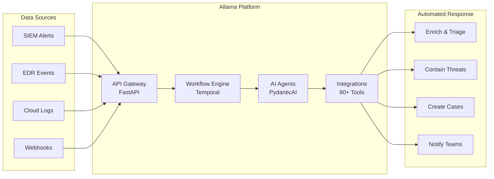

# Defensive ops — Little Snitch for Linux · Allama

Two 2026 releases that sit on different layers of the defensive stack but share a single theme: **make the per-host / per-alert defensive layer open-source and self-hosted, after a decade where the best-in-class option was either macOS-only or commercial SOAR.**

- **[Little Snitch for Linux](../sources/defense/littlesnitch-linux)** — the open-source eBPF + Rust kernel and userland of Objective Development's per-process firewall, finally available on Linux. End of "OpenSnitch is the only option."
- **[Allama](../sources/defense/allama)** — open-source SOAR platform with a visual workflow builder, autonomous LLM agents, 80+ integrations, Temporal-backed durable execution. Legacy SOAR alternative without the $100k+ price tag.

Different layers (host firewall vs. SOC orchestrator), same direction (the *defensive* OSS gap that the C2/red-team OSS market filled five years ago is now closing).

| | Little Snitch for Linux | Allama |
|---|---|---|
| Layer | Host network firewall (per-process) | SOC orchestration / SOAR |
| Author | Objective Development (Austria) | digitranslab |
| License | GPL-2.0 (OSS components) | AGPL-3.0 |
| Language | Rust + eBPF | Python + FastAPI + Temporal + PydanticAI |
| Released | April 2026 | February 9, 2026 |
| Submodule | [`sources/defense/littlesnitch-linux`](../sources/defense/littlesnitch-linux) | [`sources/defense/allama`](../sources/defense/allama) |

---

## Little Snitch for Linux — eBPF, Rust, web-UI per-process firewall

**Repo:** `obdev/littlesnitch-linux`. The repo contains the **open-source portion** of the product — eBPF programs, common types/utilities, a demo-runner that loads the eBPF programs and exercises blocklists, and the JavaScript web UI. The full product also includes proprietary userspace code that's *not* in this repository. The OSS portion ships under **GPL-2.0**.

### Why this is a release worth tracking

For a decade the per-process Linux firewall niche was occupied by exactly one OSS project: **[OpenSnitch](https://github.com/evilsocket/opensnitch)** (Simone Margaritelli's GNU/Linux reimplementation of the Little Snitch concept, 13k+ stars). OpenSnitch is mature and good. But the *original* Little Snitch shipping Linux support — with Objective Development's two decades of UX investment behind it, and with the kernel component as **eBPF rather than netfilter queues** — changes the OSS choice space.

What's actually in this repo:

| Crate / dir | Role |
|---|---|
| `ebpf/` | All eBPF programs attached to the Linux kernel (process-tagged egress/ingress hooks). |
| `common/` | Types and helpers shared between kernel and userspace. |
| `demo-runner/` | A userspace program demonstrating how to load the eBPF programs and exchange blocklists via eBPF maps. Loads `blocked_hosts.txt` and `blocked_domains.txt` as worked examples. |
| `webroot/` | The JavaScript web UI (used for remote monitoring; the full product makes a Linux server's Little Snitch viewable from any browser including from macOS). |

### What's novel vs. OpenSnitch

1. **eBPF rather than libnetfilter_queue.** OpenSnitch routes packets up to userland via netfilter NFQUEUE, then makes the allow/block decision in a Python daemon, then re-injects. Little Snitch for Linux does the per-process tagging and decision in **eBPF programs running in-kernel**, with userspace involved only for state and UI. That's lower latency, lower per-packet CPU, and (in 2026) the architecturally correct approach. The README is explicit about the kernel-version expectations: tested on Linux 6.12 to 7.0 with Rust 1.93.0-nightly (2025-11-12). eBPF verifier acceptance is fragile across nightly Rust versions — that fragility is acknowledged, not papered over.

2. **Rust userspace.** OpenSnitch's daemon is Python. Little Snitch for Linux's userspace is **Rust**. Lower memory footprint, no GIL, fewer dependencies, easier to ship as a single binary.

3. **Web UI as the primary surface.** OpenSnitch ships a Qt desktop app as its UI. Little Snitch for Linux ships a **web app** (the `webroot/` in the repo). Practical consequence: you can run Little Snitch on a headless Linux server (jumphost, container host, edge VM) and **monitor it from any browser**, including from macOS using the same Little Snitch mental model. This is the right shape for cloud-native deployments where the host doesn't have a display.

4. **OSS + proprietary split is honest.** The repo is explicit: the eBPF kernel component and the web UI are GPL-2.0 open source; some user-space code stays proprietary. That's a less attractive license posture than OpenSnitch's full-GPL but it's a workable trade — eBPF programs that attach to the kernel must be GPL-compatible anyway (kernel ABI requires it), so the open part is exactly the part that needs to be open.

### Strategic positioning

Picking between OpenSnitch and Little Snitch for Linux in 2026:

| Decision driver | OpenSnitch | Little Snitch for Linux |
|---|---|---|
| Want fully-OSS daemon (no proprietary userland) | ✅ | ❌ (some proprietary userspace) |
| Want eBPF (lower overhead, modern kernel) | ❌ (netfilter NFQUEUE) | ✅ |
| Want headless / remote-browser UI | ❌ (Qt desktop) | ✅ (web UI) |
| Want Python plugins / extension by editor | ✅ | ❌ |
| Polished UX out of the box | ⚠️ | ✅ |
| Mature, battle-tested | ✅ | ⚠️ (new) |
| Active development | ✅ | ✅ |

For a Russian-context recommendation: **OpenSnitch remains the safer pick when you need 100% OSS with no proprietary userland**. Little Snitch for Linux is the better pick when **eBPF performance and the web-UI deployment model matter**, and you can tolerate that the full product includes proprietary closed-source userspace components alongside the OSS pieces. Both can coexist on different hosts.

### Where this fits in the broader picture

Little Snitch for Linux is one piece of a larger **2026 host-defense renaissance** that the conferences index already covers in pieces:

- **Falco + Stratoshark** (CNCF) — runtime detection for container workloads; covered in `TOOLS.md`.
- **Tetragon** (Isovalent / Cilium) — eBPF security observability; covered.
- **Tracee** (Aqua) — eBPF runtime security; covered.
- **Little Snitch for Linux** — eBPF *per-process firewall* for non-container hosts. The piece the others didn't fill.

The four together are the eBPF-native defensive stack for 2026 Linux. Each owns a different layer:

```
              Container workload                Bare-metal / VM host
              ─────────────────                 ────────────────────
   Detection     Tetragon / Tracee                 Falco + Stratoshark
   Enforcement   Cilium NetworkPolicy              Little Snitch for Linux
   Forensics     —                                 mquire (from ../sources/dfir/)
```

The strategic-session takeaway: 2025–2026 is when the eBPF defensive layer became **complete enough** to make recommending an eBPF-first defensive stack non-controversial.

---

## Allama — open-source SOAR with visual workflows + LLM agents

**Repo:** `digitranslab/allama` · License: **AGPL-3.0** · Python 3.12+, FastAPI, Temporal, PydanticAI, LiteLLM. Released February 2026.

A self-hosted SOAR (Security Orchestration, Automation, and Response) platform: visual workflow builder, autonomous LLM agents, 80+ integrations, durable execution, multi-tenant. The competitive frame is **Splunk SOAR / Palo Alto XSOAR / Tines / Torq** — commercial SOAR products in the $50k–$500k/year range.

### Why an OSS SOAR in 2026 matters

The SOAR market has been **structurally underserved by OSS** for a decade. Shuffle ([`Shuffle/Shuffle`](https://github.com/Shuffle/Shuffle)) and StackStorm ([`StackStorm/st2`](https://github.com/StackStorm/st2)) were the main contenders; neither got enough adoption to break the commercial vendor lock-in. The combination of (a) **LLM agents** as a new SOAR primitive, (b) **Temporal** maturing into a stable durable-execution engine, and (c) **PydanticAI / LiteLLM** simplifying multi-model orchestration, has shifted the build-vs-buy math.

Allama is positioned exactly at that shift.

### What's novel vs. prior OSS SOAR

1. **AI agents as a first-class primitive.** The "AI-Powered Agents" component deploys autonomous LLM agents that *understand* threats, make decisions, and execute responses. Multi-model support — **OpenAI / Anthropic / Azure / self-hosted via Ollama** — through PydanticAI + LiteLLM. Allama is the first OSS SOAR to ship this end-to-end at release, rather than as a 2.x add-on.

2. **Temporal for durable execution.** The workflow engine is built on [Temporal](https://temporal.io/) (the open-source durable workflow runtime spun out of Uber). This means **automatic retry, state persistence, and crash-resilient long-running workflows** — exactly what a SOAR needs (alert triage can take hours, integrations fail intermittently). Shuffle uses its own runtime; StackStorm uses its own. Temporal is the most production-hardened option in OSS today, and using it as the foundation is a strong architectural choice.

3. **PydanticAI + LiteLLM for the agent layer.** PydanticAI gives the agents *typed* tool definitions; LiteLLM gives uniform multi-provider access. The combination is becoming the de-facto Python agent stack in 2026 (also visible in the AIxCC CRS releases and in Hadrian's planner — see [`api-security.md`](./api-security.md)).

4. **WebAssembly sandbox for custom Python.** Custom scripts run inside isolated **WebAssembly sandboxes** with network isolation, resource limits, and full audit logging. This is the right shape for SOAR — analysts need to write quick Python to enrich an alert, but their script can't be allowed to exfiltrate the SOAR's secrets or call arbitrary APIs. WASM is the modern answer (vs. Shuffle's container-per-script approach).

5. **80+ integrations across SIEM / EDR / Identity / Ticketing / Comms / Threat Intel / Cloud.**

   | Category | Tools listed in the README |
   |---|---|
   | SIEM | Splunk, Elastic, Datadog, Wazuh |
   | EDR/XDR | CrowdStrike, SentinelOne |
   | Identity | Okta, Microsoft Entra ID, Google Workspace |
   | Ticketing | Jira, Zendesk, PagerDuty |
   | Communication | Slack, Microsoft Teams, Email |
   | Threat Intel | VirusTotal, URLScan, IPInfo, Anomali |
   | Cloud | AWS, Google Cloud, Kubernetes |

6. **Auth surface that matches enterprise expectations.** SAML 2.0 (Okta, Entra ID), Google OAuth, Basic. RBAC + workspace isolation, AES-256 encrypted secrets with automatic injection, full audit history. This is the **table-stakes enterprise feature set** that historically only commercial SOAR shipped; having it in OSS at release is significant.

7. **Multi-tenant + MSSP-ready.** Workspace isolation + multi-tenant architecture are first-class. White-label deployment is a documented use case. This makes Allama the first credible **OSS SOAR for managed-services providers**.

### Architecture



| Component | Tech |
|---|---|
| API Gateway | FastAPI (auth + routing + OpenAPI docs) |
| Workflow Engine | Temporal |
| AI Agents | PydanticAI + LiteLLM |
| Sandbox | WebAssembly |
| Database | PostgreSQL |
| Object storage | S3-compatible |

### Strategic positioning vs. other OSS SOAR

| Tool | Frontend | Workflow runtime | LLM agents | Multi-tenant |
|---|---|---|---|---|
| **Allama** | Visual builder | Temporal | Native (PydanticAI/LiteLLM) | Yes |
| **Shuffle** | Visual builder | Own runtime | Plugin-level | Limited |
| **StackStorm** | YAML / Mistral DSL | Own runtime | None | No (single-org) |
| **n8n** (general automation) | Visual builder | Own runtime | Plugin-level | Limited |
| **TheHive + Cortex** | Web UI | Cortex analyzers | None | Org-level only |

For a 2026 SOC that wants:
- **Open-source SOAR with modern agent primitives** → Allama is the clear pick.
- **Most-mature OSS SOAR with a large integration catalog** → Shuffle is still the leader on raw integration count.
- **Pure detection/case-management without orchestration** → TheHive + Cortex is the right pick.

### Strategic positioning vs. commercial SOAR

The honest read is that Allama is **not yet a 1:1 replacement** for Splunk SOAR or XSOAR for a Fortune 500 SOC — the commercial tools have a decade of playbook libraries, vendor relationships, and 24/7 support. But for the **80% of mid-market SOCs** that can't afford those tools and currently triage alerts in spreadsheets, Allama is the first credible OSS option that ships with:

- LLM agent enrichment (the marketing claim is "90% faster triage").
- Visual workflow builder with conditional logic + parallel + loops.
- Multi-tenant + SSO + audit.

The price-comparison the README leads with — "$100k+ commercial vs. self-hosted free" — is honest. The catch is **integration maturity**: 80+ integrations sounds large, but many will be at v0.x maturity at release. Expect the next 12 months to be where Allama either fills out those integrations or fades.

### Where Allama fits in the stratsession picture

Allama is the **defensive endpoint** of the same pipeline that the offensive tools in [`ci-cd-security.md`](./ci-cd-security.md), [`api-security.md`](./api-security.md), and [`cloud-posture.md`](./cloud-posture.md) generate findings for. The natural shape:

```
Findings sources                     Orchestration                          Response actions
────────────────                     ─────────────                          ────────────────
SmokedMeat tabletops      ──┐
Plumber CI/CD compliance   ──┤
cloud-audit AWS scans      ──┤
Hadrian API authZ tests    ──┼──►  Allama workflows  ──►   Jira / PagerDuty / Slack
DefectDojo findings        ──┤      (LLM enrichment +       cloud-audit simulate
mquire IR analysis         ──┤       Temporal durable        Brisket detonation
SIEM alerts                ──┘       execution)              (SmokedMeat range)
```

The interesting integration story is **Allama + DefectDojo + cloud-audit** as a Russian-team-affordable Trinity:
- DefectDojo for vuln-management system of record.
- Allama for orchestration + LLM triage.
- cloud-audit as the AWS posture feed.

Zero commercial licensing. Self-hosted. Three repos.

### Adjacent OSS to know about (not mirrored)

- **[Shuffle](https://github.com/Shuffle/Shuffle)** — the mature OSS SOAR competitor.
- **[TheHive](https://github.com/TheHive-Project/TheHive)** + **[Cortex](https://github.com/TheHive-Project/Cortex)** — incident-response case-management + analyzer framework. Pairs well with Allama for SOCs that want case management plus orchestration.
- **[StackStorm](https://github.com/StackStorm/st2)** — general-purpose event-driven automation; older, still useful.
- **[n8n](https://github.com/n8n-io/n8n)** — general workflow automation; not security-focused but increasingly used for SOAR-shaped tasks.
- **[Temporal](https://github.com/temporalio/temporal)** — the durable-execution foundation; useful to understand directly.

---

## How both tools change the defensive shape in 2026

1. **Host network observability is becoming eBPF-native, OSS, and per-process.** Little Snitch for Linux + OpenSnitch on the personal/server side, Tetragon + Falco on the container side. Defenders no longer have to choose between "pcap everything" and "block by socket." The middle layer (per-process intent → per-flow enforcement) is now well-served by OSS.

2. **SOAR is becoming OSS, finally.** Allama doesn't replace Splunk SOAR for the Fortune 500, but it puts a credible self-hosted SOAR within reach of every mid-market SOC, MSSP, and Russian-context budget. The next 12 months determine whether it consolidates the market or stays a "promising newcomer."

3. **LLM agents are the new SOAR primitive.** Allama is one of the first to ship them at release rather than as a 2.x bolt-on. Expect every commercial SOAR to follow within 12 months.

4. **AGPL-3.0 is the OSS SOAR license of choice now.** Allama is AGPL-3.0; SmokedMeat is AGPL-3.0; Buttercup is mixed. The pattern is consultancies / vendors releasing the core under AGPL to avoid pure free-rider competition while keeping the OSS commitments real. This will shape commercial fork attempts — AGPL is sticky.
