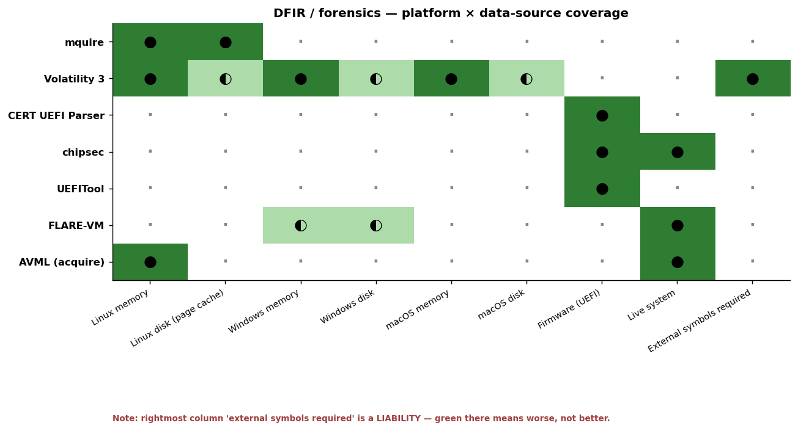

# Firmware & memory forensics — CERT UEFI Parser · mquire

Two tools released in early 2026 that each remove a long-standing **external-dependency** requirement in low-level forensics:

- **[CERT UEFI Parser](../sources/dfir/cert-uefi-parser)** — parses UEFI firmware images, installer packages, and PE binaries *without* relying on EDK2 reference parsers or vendor SDKs.
- **[mquire](../sources/dfir/mquire)** — analyzes Linux memory dumps *without* external debug symbols, using BTF + Kallsyms data already embedded in modern kernels.

Both are "the part of the toolchain you used to have to source from the vendor (or scrape from a debug package) is now self-contained in the snapshot itself." Both came out of well-credentialed organizations (CMU/SEI for UEFI, Trail of Bits for mquire) and are licensed permissively. Different layers of the stack, same architectural insight.

| | CERT UEFI Parser | mquire |
|---|---|---|
| Layer | UEFI firmware (pre-OS) | Linux kernel memory (post-OS) |
| Author | CMU/SEI CERT | Trail of Bits (Alessandro Gario) |
| License | (LICENSE.md — permissive) | Apache 2.0 |
| Language | Python 3 (Construct + PySide6 optional) | Rust |
| Distribution | PyPI (`cert-uefi-parser` + `cert-uefi-support`) | Cargo, deb/rpm/tar.gz from CI |
| Output | ASCII / JSON / SBOM-JSON / Qt GUI | Interactive SQL shell + JSON / table |
| Submodule | [`sources/dfir/cert-uefi-parser`](../sources/dfir/cert-uefi-parser) | [`sources/dfir/mquire`](../sources/dfir/mquire) |

These are research-grade DFIR tools — the kind that academic groups and incident-response consultancies will adopt quickly, while enterprise SOCs will adopt slowly because their existing playbooks pivot on Volatility / EnCase / FTK.

## How the DFIR OSS landscape covers platform × data source



Reading the matrix:

- **Volatility 3 is the only tool with cross-OS memory coverage** (Linux + Windows + macOS). The catch is the rightmost column: it **requires external debug symbols**, which is the pain point mquire was built to remove.
- **mquire owns Linux memory + Linux disk (via page-cache recovery)** without symbols, but does not cover Windows or macOS yet. Pair with Volatility 3 for cross-OS workloads.
- **The firmware layer is its own world** — CERT UEFI Parser, chipsec, and UEFITool all live in the rightmost column with no overlap with the memory tools. CERT UEFI Parser's `--sbom` output is the bridge to SBOM/compliance pipelines.
- **AVML is the acquisition tool, not the analyzer.** It produces the `.lime` snapshots mquire reads. The pair `AVML → mquire` is the modern Linux memory-forensics canonical path.

The **rightmost column is annotated as a liability** — `external symbols required` is the cell where you want *less* coverage. Volatility 3 carries that burden today; the field is shifting toward tools that don't need it (mquire is the proof).

---

## CERT UEFI Parser — UEFI introspection without vendor SDKs

**Repo:** `cmu-sei/cert-uefi-parser` (parser) + `cmu-sei/cert-uefi-support` (decompression / binary utilities). PyPI: `cert-uefi-parser`, `cert-uefi-parser[qt]` for the optional Qt GUI.

A Python tool that walks a firmware ROM, an installer package, or a UEFI image and **decomposes it into a machine-readable model of the firmware architecture** — modules, execution phases, protocols, dependencies, embedded PEs.

### Why it exists

Historically, UEFI analysis happened with one of:

| Tool | Limitation |
|---|---|
| **EDK2 reference** | Rigid; tied to Intel's reference format; hard to extend to vendor-proprietary container formats. |
| **UEFITool** (`LongSoft/UEFITool`) | The community standard for ROM unpacking, but GUI-first and not designed for structured/SBOM output. |
| **Vendor SDKs** (Insyde, AMI, Phoenix) | NDA-encumbered. |
| **chipsec** (Intel) | Live-system focused, not image-parsing focused. |

CERT UEFI Parser fills the **machine-readable, NDA-free, extensible** seat between those: built on the [Construct](https://construct.readthedocs.io/) declarative-binary-parsing framework, which makes adding support for a new vendor's proprietary header a contained patch rather than a fork.

### What's novel

1. **Built on Construct.** The classic UEFI parsers are C/C++ codebases with hand-written byte-walkers per format. Construct lets you describe a structure declaratively in Python; supporting a new vendor variant is an additive change. This is the same idea Kaitai Struct exposes, applied to a research-grade firmware parser. Extending CERT UEFI Parser to a new ME variant or vendor capsule format is a few hundred lines, not a fork.

2. **Output modes designed for downstream tooling.**
   - `--gui` — PySide6 / Qt6 GUI for interactive inspection.
   - `--text` — ASCII with ANSI color (default).
   - `--json` — full machine-readable structure (the input to your analysis pipeline).
   - `--sbom` — filtered JSON containing only the fields useful for **SBOM generation** (CycloneDX/SPDX downstream).
   
   The `--sbom` mode is the under-appreciated one: firmware SBOMs are an emerging requirement (CISA SBOM guidance + CRA in EU), and CERT UEFI Parser is one of the first OSS tools that emits the right shape directly. The pair `cert-uefi-parser --sbom firmware.rom` + a CycloneDX wrapper is the simplest "firmware bill of materials" stack you can assemble in 2026.

3. **Coverage of proprietary structures, openly.** The README is explicit: *"The project is free of NDAs or other restrictions; all proprietary formats have been reverse engineered from public information and original analysis."* Vendor formats supported include Intel ME structures (Igor Skochinsky's research lineage), nested PE images, vendor capsule formats. The repository imports research from [CERTCC/UEFI-Analysis-Resources](https://github.com/CERTCC/UEFI-Analysis-Resources) — the companion documentation repo with EDK2 dev overview, vendor format notes, classification of class-of-vulnerability patterns.

4. **Independent verification path for vendor advisories.** When a vendor publishes a UEFI advisory ("affected modules: X, Y, Z"), an analyst with CERT UEFI Parser can:
   - Dump the firmware update package.
   - `cert-uefi-parser --json firmware.bin > parsed.json`
   - Verify presence/version of the named modules, dependencies, and Execution Phase classification.
   - Cross-check against the advisory.

   That workflow used to require either a vendor SDK or hand-rolled scripts on top of UEFITool. CERT UEFI Parser is the first OSS tool that gives you that workflow in two commands.

### Strategic positioning

CERT UEFI Parser sits next to the **ReVault attack chain** (Hexacon 2025, Dell ControlVault3 across 100+ laptop models) and the **EntrySign** custom-microcode research (OffensiveCon 2025) — both of which are documented in the conferences index. Those are the kind of vulnerabilities that *generate* the firmware images CERT UEFI Parser then helps you triage. The tool is the **defender / vulnerability-research analyst's primitive** that pairs with the attack research surfaced at Hexacon and OffensiveCon.

Russian-context note: the tool is also a useful **import-substitute** for firmware analysis pipelines that previously depended on vendor SDKs or on commercial reversing platforms (Binary Ninja firmware plugin, IDA's `efitool` plugin) — both subject to export controls. Construct + Python + open license is a fully self-contained pipeline.

### Adjacent OSS to know about (not mirrored)

- **[UEFITool](https://github.com/LongSoft/UEFITool)** — community-standard GUI parser. Different shape (interactive, not SBOM-emitting); still the right tool for click-through inspection.
- **[chipsec](https://github.com/chipsec/chipsec)** — Intel's live-system UEFI / chipset analyzer. Operates against a running machine, not against a ROM image.
- **[fwhunt-scan](https://github.com/binarly-io/fwhunt-scan)** — Binarly's IDA-script-driven scanner; commercial-leaning but the public scanner is OSS.
- **[CHIPSEC + Binarly Risk Hunt](https://www.binarly.io/)** — the commercial reference stack; CERT UEFI Parser is the **research-friendly OSS counterpart**.

---

## mquire — Linux memory forensics without debug symbols

**Repo:** `trailofbits/mquire` · License: Apache-2.0 · Rust. Author: Alessandro Gario / Trail of Bits. Released Feb 25, 2026.

A memory-querying tool inspired by [osquery](https://github.com/osquery/osquery) — and that's the right mental model. You feed it a Linux memory snapshot (`.raw`, `.lime`, ELF core dump) and you get an **interactive SQL shell** over kernel data structures. The advantage that makes the tool novel: **it needs zero external debug symbols.**

### The key insight

Traditional Linux memory forensics (Volatility 3, Rekall, LiME → manual parsing) requires **kernel-version-matched debug symbols**, which are:
- Not shipped on production systems by default.
- Sourced from external repositories (Ubuntu `ddebs`, Red Hat `debuginfo`, distro-specific kernel-dbgsym packages).
- **Quickly outdated** when the system being analyzed has received updates — the symbols you need are gone from the mirror.
- **Often unavailable** for custom kernels, embedded distros, vendor-shipped appliances.

mquire's claim: that problem **doesn't exist for kernels with BTF and modern kallsyms enabled**, because the snapshot itself already contains everything mquire needs.

### How

Two embedded data sources do all the work:

1. **BTF ([BPF Type Format](https://www.kernel.org/doc/html/next/bpf/btf.html))** — describes the structure and layout of kernel data types. Kernel 4.18+ with BTF enabled (most modern distros, default-on). Parsed via the [btfparse](https://crates.io/crates/btfparse) Rust crate (also from Trail of Bits).
2. **Kallsyms** — provides the memory locations of kernel symbols, same data as `/proc/kallsyms`. Kernel 6.4+ (newer format from `scripts/kallsyms.c`).

Combine type information with symbol locations → mquire reconstructs complex kernel data structures (process lists, memory mappings, open file handles, page-cache pages, kernel ring buffer) directly from the snapshot.

### What you can query

Tables exposed via SQLite (the SQL engine mquire wraps over the kernel-memory backing store):

| Category | Tables |
|---|---|
| System | `os_version`, `system_info`, `boot_time`, `kallsyms`, `dmesg` |
| Process | `tasks`, `task_open_files`, `memory_mappings` |
| Kernel modules | `kernel_modules` (with state, version, parameters, taint flags) |
| Network | `network_connections`, `network_interfaces` |
| Filesystem | `syslog_file` (read straight from page cache) |
| Diagnostics | `mquire_diagnostics` |

Custom commands (dot-prefixed):

- `.task_tree` — `pstree`-like hierarchy with optional `--show-threads` and `--use-real-parent` (catches re-parenting after death of the original parent).
- `.dump <dir>` — walk every open file descriptor of every task, extract the file content from the **page cache** to disk. Recovers deleted files that were still cached. *This is the headline DFIR primitive — page-cache extraction without filesystem mount.*
- `.carve <root_pt> <vaddr> <size> <out>` — extract a raw virtual-memory region using a specific page table. Useful for process-memory recovery, heap content, etc.
- `.system_version` — convenience formatter.

### Standout primitives

1. **Page-cache file recovery (`.dump`).** Recovers files that have been deleted on disk but were still mapped in the kernel's page cache at snapshot time. This is one of the **highest-yield DFIR primitives** — attackers routinely `unlink` payloads after exec; mquire pulls them back from RAM. Traditional toolchains (Volatility plugins) can do this in principle but require the matching debug profile.

2. **Multi-source task discovery for rootkit detection.** Each task is discovered via **multiple independent sources** (different walks of kernel data structures). When a task appears in source A but not source B → likely **rootkit-hidden**. The shipped view `200_hidden_process_detection.sql` (in `sql/views/linux/common/`) operationalizes this as a one-liner: `SELECT * FROM hidden_processes`.

3. **Virtual addresses as canonical join keys.** A deliberate design choice: tables join on `virtual_address` of the underlying `task_struct`, not on `pid`. PIDs can repeat across discovery sources or root tasks; virtual addresses uniquely identify a specific kernel object. The whole `LinuxOperatingSystem` API is built around this convention. The result: queries that span tables stay stable across snapshots with weird state (memory corruption, snapshot timing, rootkit interference).

4. **Materialization-aware SQL workflow.** mquire is **not a database** — every table access reconstructs kernel structures by walking memory. The README is explicit: use `AS MATERIALIZED` in CTEs to cache expensive table scans when joining. The shipped benchmark (Ubuntu 24.04 snapshot, 351 processes, 50 connections, 2142 open files): 12.067s without materialization → 3.171s with, **3.8× faster**. Performance engineering surfaces directly to the analyst.

5. **Autostart SQL files + shipped views.** `$HOME/.config/trailofbits/mquire/autostart/` is a hierarchical directory (`common/common/`, `common/{arch}/`, `{os}/common/`, `{os}/{arch}/`) of `.sql` files auto-loaded on startup. Combined with the shipped views (`000_processes.sql`, `100_process_network_connections.sql`, `200_hidden_process_detection.sql`), this is the osquery-style "build up an analyst library over time" workflow — but for memory forensics.

6. **Snapshot format coverage.**
   | Format | Extension | Source |
   |---|---|---|
   | Raw | `.raw` | `dd if=/dev/mem` (deprecated), DMA capture |
   | LiME | `.lime` | [504ensicsLabs/LiME](https://github.com/504ensicsLabs/LiME) (mostly unmaintained now) |
   | ELF core | `.elf` | `virsh dump`, QEMU `dump-guest-memory` |
   
   The recommended acquisition tool is **Microsoft's [AVML](https://github.com/microsoft/avml)** (cross-distro, single binary). Caveat: AVML's `--compress` produces a format mquire doesn't read — decompress with `avml-convert` first.

### Where mquire fits in the stack

mquire is the **post-AIxCC OSS DFIR primitive** in the same way Buttercup is the post-AIxCC OSS vulnerability-research primitive. Both came out of the same general "Trail of Bits is operationalizing research into shippable OSS" pipeline that also produced [Trailmark](https://github.com/trailofbits/trailmark), [CoBRA](https://github.com/trailofbits/CoBRA), and [Ruzzy](../sources/appsec/ruzzy).

For a SOC / IR practice in 2026, the stack looks like:

```
Live host → AVML → .lime snapshot
                       ↓
                    mquire ──► SQL queries (rootkit detection, page-cache recovery)
                       ↓
                    .dump ──► extracted files → standard DFIR (YARA, hash lookup, sandboxing)
```

Compared to Volatility 3: Volatility has wider plugin coverage (Windows + Mac + many subsystems), still depends on profile/symbols, and the Python overhead shows on large snapshots. mquire is **Linux-only, BTF-required, much faster, no profile needed**. Use both — mquire for "the symbols aren't available," Volatility 3 for "the symbols are available and you want plugin coverage I haven't yet built in mquire."

### Adjacent OSS to know about (not mirrored)

- **[Volatility 3](https://github.com/volatilityfoundation/volatility3)** — the standard. Python, profile-dependent.
- **[AVML](https://github.com/microsoft/avml)** — Microsoft's recommended acquisition tool for Linux memory.
- **[LiME](https://github.com/504ensicsLabs/LiME)** — historical acquisition tool. mquire still reads its output format.
- **[btf2json](https://github.com/lolcads/btf2json)** — the academic precursor (lolcads' research blog post on using BTF for memory forensics). mquire is the productionization.
- **[osquery](https://github.com/osquery/osquery)** — the live-system inspiration for the SQL interface.

### Strategic positioning

mquire is the right tool to standardize on if **any of these are true for your environment**:
- You analyze memory snapshots from kernels you don't fully control (cloud VMs, customer-owned hosts, custom embedded distros).
- You need to recover deleted files from RAM.
- You want a fast, scriptable SQL layer over kernel state.
- Your existing Volatility workflow is bottlenecked on the "find the right symbol package" step.

For research and consultancy use it's already strong. For high-volume SOC use the gap is plugin breadth (Volatility 3 has more, mquire is younger). Expect that gap to close over 12–18 months.

---

## How both tools change the forensics shape in 2026

1. **The "external symbol/SDK dependency" assumption is dying.** Both tools attack the same architectural pain point — needing data you can't ship inside the artifact you're analyzing — and both solve it by leaning on data that's *already there* (Construct-described UEFI structures vs. vendor SDKs; BTF + kallsyms vs. external debug symbols). Expect the same pattern in adjacent categories: Windows memory forensics is the obvious next target now that Microsoft is shipping debug data inside Windows kernels via `kdbgctrl`-style mechanisms.

2. **SBOM is becoming a forensics output, not just a SDLC output.** CERT UEFI Parser's `--sbom` mode and the wider firmware-SBOM regulatory push (CRA, CISA guidance) mean **firmware analyzers will be expected to emit machine-readable inventories**. The first one that emits **CycloneDX HBOM (Hardware Bill of Materials)** as a native output will own the next 12 months of compliance pipelines.

3. **SQL-over-kernel-memory is the right interface for analysts.** osquery proved this for live systems; mquire proves it for snapshots. Expect equivalent SQL frontends for Windows memory (probably built on Rekall's KDBG walker) and for K8s pod memory dumps (using BTF the same way as mquire).

4. **Both tools are "research-grade today, SOC-standard tomorrow."** Same trajectory as ProcessHacker → System Informer, or Sysmon → Falco. Adopt early in research / IR consulting workflows; expect to see them in commercial DFIR product feature lists by 2027.
