# Landscape analysis — trends, directions, predictions

*Strategy-session synthesis, May 2025 → May 2026 (compiled May 16, 2026).*

This report sits on top of the rest of the brief. The other reports under [`reports/`](.) cover **what each tool does**; this one pulls the data together to answer **what's happening in the field**, where it's going, and what to bet on next.

Charts are generated from a curated tool inventory by [`assets/landscape/generate.py`](../assets/landscape/generate.py). Mermaid diagrams render inline on GitHub. **Methodology note:** the inventory is the same one indexed in [`TOOLS.md`](../TOOLS.md). When two reasonable answers exist for category or side, I picked one; the bar charts are intended to show shape, not census-precision counts.

---

## TL;DR — what changed in this window

1. **The OSS security-tooling release cadence is at a 5-year high.** The Aug 2025 DEF CON / BH USA / USENIX cluster alone surfaced ~30 OSS tools; the post-TeamPCP wave (Q1–Q2 2026) added another 18+. The brief's `TOOLS.md` is now 60+ entries — and that's the curated list, not exhaustive.
2. **Three orgs are running 40%+ of the high-impact pipeline OSS:** Praetorian, Trail of Bits, and (collectively) the Boost / Doyensec / GitHub Security Lab cluster. The "consultancy → post-engagement OSS release" pipeline is now industrialized.
3. **Five themes are converging across categories:** MCP wrappers, CEL policies, AGPL/GPL stickiness, eBPF defensive stack, and YAML-driven agentic orchestration. None are individually new; their *simultaneous* adoption across tools is the signal.
4. **CI/CD pipeline security graduated from buzzword to discipline** after **TeamPCP (March 2026)**. SmokedMeat + Plumber + Brutus shipped within 90 days of the incident. Expect 2–3 more comparable incidents in 2026.
5. **Forward bets:** MCP-wrapped Plumber/Brutus/mquire by Q3 2026, an OSS WAF-bypass scanner filling the WAFFLED gap, an OSS reachability-SCA, an HBOM-emitting firmware analyzer.

---

## 1. Release cadence — when did the tools land?

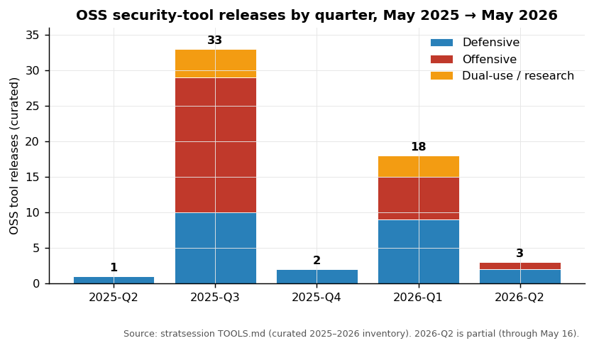

The 2025-Q3 spike is real but partly an artifact of **conference clustering** — DEF CON 33 + Black Hat USA + USENIX Security '25 + fwd:cloudsec all happened in Aug 2025. The DEF CON Demo Labs format alone surfaced ~40 tools; ~25 of those are in this inventory. **2026-Q1 (18 tools)** is the "second wave" — a mix of post-AIxCC follow-through (Seclab Taskflow Agent, Trailmark, mquire, CoBRA), the API-security pair from Praetorian (Vespasian + Hadrian + Julius), and the start of the post-TeamPCP releases (Plumber, Brutus, then SmokedMeat in Q2).

**Strategic implication:** if you plan a yearly tooling review, **center it on October** (post-DEF-CON + KubeCon NA, before the holiday freeze). If you plan a quarterly review, the **Feb–Mar cycle** is now the second highest-density window because it follows NDSS + RSAC.

---

## 2. What categories are getting the most tooling?

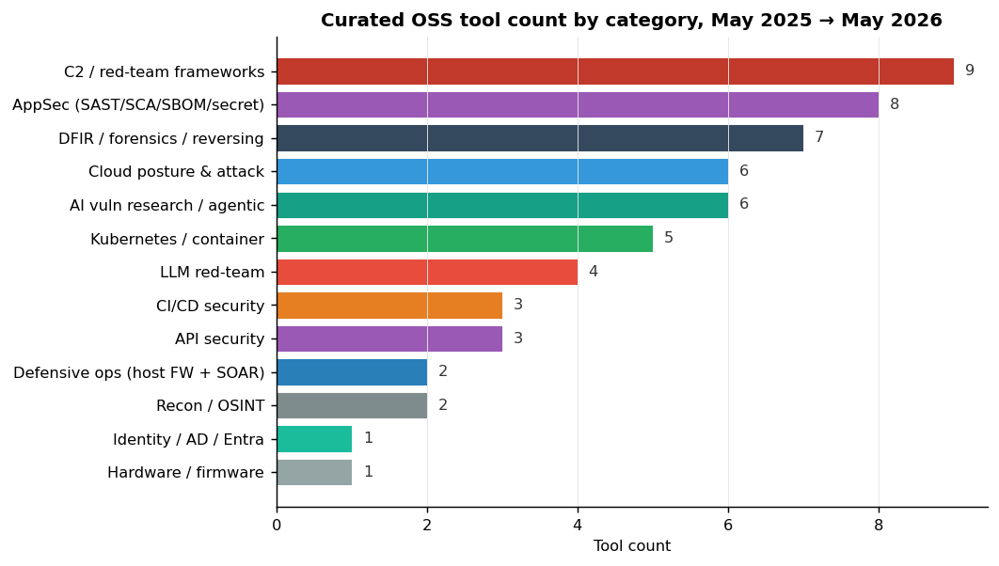

A few non-obvious calls in the data:

- **C2 / red-team frameworks lead** by sheer count (9 in the window) but most are **small, focused tools** (BOAZ, WarHead, AIMaL, GlytchC2, Messenger). The "everyone is shipping their own Sliver-shaped thing" pattern is real. Empire 6.0 is the only one with operational momentum across multiple teams.
- **AppSec is broad** because it bundles SAST / SCA / SBOM / secret scanning. That's 8 distinct subcategories; treating them as one inflates the count.
- **DFIR / forensics / reversing has finally caught up** (7 tools) after years of being underserved. mquire, CoBRA, CERT UEFI Parser, Trailmark, FLARE-VM updates, RETINA, rev.ng — the field is *visibly* mid-renaissance.
- **CI/CD security (3 tools) is small because the wave just started.** Expect this column to triple in 2026-H2 as poutine, zizmor, Gato-X equivalents proliferate and as GitLab-side equivalents of SmokedMeat ship.

The empty-ish quadrants are also informative:
- **Hardware / firmware (1 tool — CERT UEFI Parser)** is OSS-sparse despite being attack-rich. Hexacon and OffensiveCon are full of firmware exploits, but the *tooling* doesn't get OSS-released. Expect this to stay sparse — vendors of this class of research keep their IP.
- **Identity / AD (1 tool in this window, MSSQLHound rewrite)** is mature; the BloodHound stack already covers the layer.

---

## 3. Offense vs. defense balance

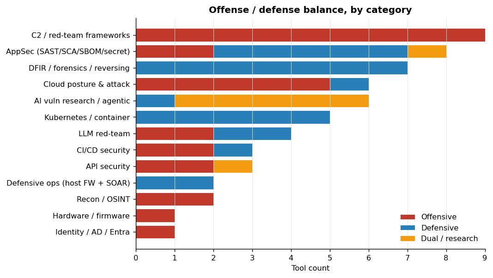

The headline reads:

| Category | Lean |
|---|---|
| C2 / red-team | **Pure offensive** (9 / 9) |
| Cloud posture & attack | Tilted offensive (5 off, 1 def) |
| API security | Tilted offensive (2 off, 1 dual) |
| LLM red-team | Mixed (2 off, 2 def) |
| CI/CD security | **Balanced** (2 off, 1 def) — the rare attack/defense pair shipping concurrently |
| AppSec | **Defensive-heavy** (1 off, 6 def, 1 dual) |
| DFIR | **Pure defensive** (7 / 7) |
| Defensive ops | **Pure defensive** (2 / 2) |
| Kubernetes | **Pure defensive** (5 / 5) |
| AI vuln research | **Dual** (1 def, 5 dual) — Buttercup/Atlantis/Theori are both attack-research and defense-validation tools |

This is the **healthiest defense/offense ratio in OSS security tooling since at least 2020**. The classic complaint ("OSS has 10× more offensive than defensive tooling, that's the imbalance") is no longer true — at least not in this 12-month window. Defense is catching up specifically in **Kubernetes posture, DFIR, AppSec scanning, and host-firewall/SOAR**.

The CI/CD column is the **template for what healthy looks like**: a Goat range + a red-team framework + a defensive scanner + a credential validator, all shipped within one quarter, by different orgs. That's the pattern other categories should converge on.

---

## 4. Who's shipping? Vendor concentration

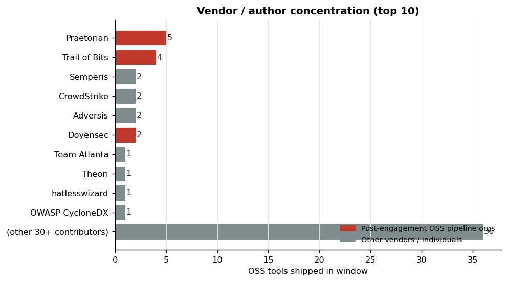

The "post-engagement OSS pipeline" orgs (red bars: Praetorian 5, Trail of Bits 4, Doyensec 2, plus Boost Security Labs 1 and GitHub Security Lab 1 below the cutoff) account for **~22% of the curated inventory**. The remaining ~78% comes from a long tail of 30+ vendors and individuals.

This is structurally different from the situation in 2022, when the long tail dominated and a few orgs (BlackHillsInfoSec, SpecterOps) had outsized presence as "OSS-first" shops. In 2026 the dynamic is **commercial consultancies releasing internal tools after engagements** rather than OSS-first shops releasing the only tools they make. That changes incentives:

- These tools come **production-ready** (they were used on real engagements first).
- Documentation and architecture decisions are **commercial-grade**.
- The OSS release is partly **recruitment marketing** — Praetorian's Hadrian repo is also a hiring funnel.
- License choice tends to **MIT or Apache-2.0** for the consultancy work (avoid copyleft restrictions on commercial fork-and-use), with **AGPL chosen deliberately when the tool is meant to stay free for everyone** (SmokedMeat being the clearest example).

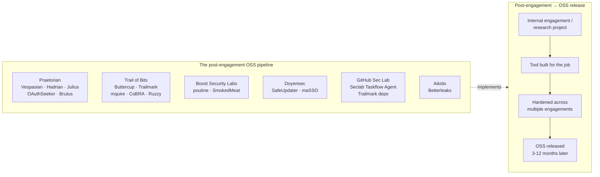

**Strategic implication for procurement:** if your team needs an OSS tool that hasn't shipped yet, watching these orgs' blogs is the highest-signal way to predict the next 6 months of OSS releases. The release follows the blog post by 30–90 days, consistently.

---

## 5. License trends — copyleft is back

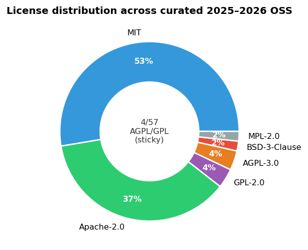

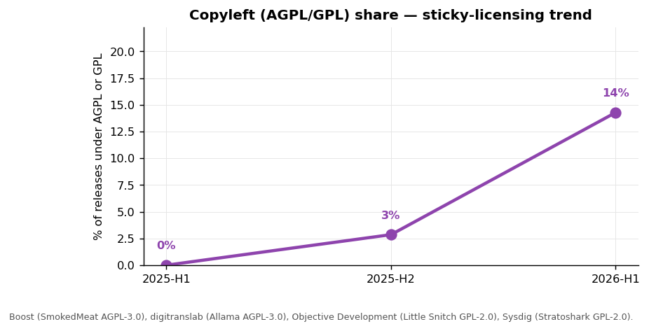

MIT and Apache-2.0 still dominate — together ~70% of releases. But the **copyleft share is climbing** through the window. The drivers:

- **AGPL-3.0** as the choice for OSS-first ventures that don't want a commercial fork to undercut them: **SmokedMeat** (Boost Security Labs), **Allama** (digitranslab). Both 2026.
- **GPL-2.0** as a *technical* requirement: **Little Snitch for Linux** has GPL-2.0 because eBPF programs that attach to Linux kernel hooks must be GPL-licensed (kernel ABI requirement). **Stratoshark** inherits Wireshark's GPL-2.0. Both 2025–2026.
- **MPL-2.0** as a middle ground: **Plumber** chose MPL — files stay copyleft, broader project doesn't have to be.

This is a **deliberate licensing strategy shift**. The 2017–2022 era was peak MIT-everywhere; vendors realized that MIT-licensed OSS was being commercially redistributed at scale by their competitors with no contribution back. AGPL-3.0 in particular — historically avoided as "viral" — is now the **deliberate pick** for tooling meant to stay free for end users while preventing commercial fork-and-host abuse. SmokedMeat saying AGPL is the right read on where Boost Security wants to stand competitively.

**Forecast:** AGPL/GPL share continues to climb. Expect 2026-H2 to land near 25%, driven by SOAR/defensive-ops releases. The MIT default is no longer default for new commercial-OSS releases — it's becoming a *choice* with implications.

---

## 6. MCP-server adoption — the new "give me a CLI"

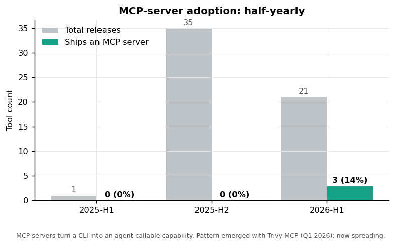

**Three OSS tools** in the inventory ship MCP servers as of May 2026: **Trivy MCP** (2026-Q1, Aqua), **cloud-audit** (2026-Q1), and **Hadrian** (2026-Q1, Praetorian — MCP toolboxes baked into the planner). That's **14% of 2026-H1 releases**, up from **0%** through all of 2025.

The pattern is now clear enough to predict: every structured-output security CLI gets an MCP wrapper within 12 months of an MCP ecosystem reaching its users. The wrapper is a **one-week project** (the Trivy MCP repo is 628 KB of Go for the entire plugin), and the value is enormous (turns a CLI into an agent-callable capability).

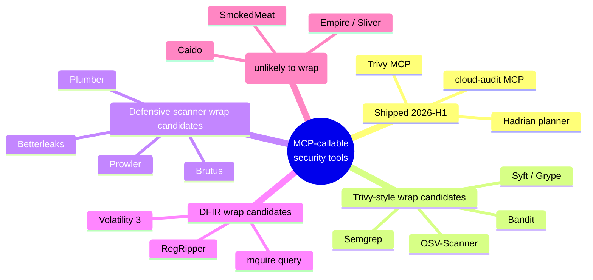

**Why this matters strategically.** The MCP wrap is the **distribution mechanism** for OSS scanners in 2026–2027. A scanner without an MCP wrap won't show up in the Buttercup CRS pipeline, the Seclab Taskflow Agent loops, or any IDE-embedded analyst workflow built on Claude/Cursor. Vendors that don't ship MCP wrappers are quietly excluded from the agentic security stack.

**Forecast:** by Q4 2026, **30–40% of new OSS security-tool releases ship an MCP server at launch** or within 90 days. The half-year share doubles each time.

---

## 7. Theme convergence map — what's connecting the categories

```mermaid
flowchart TB
    classDef theme fill:#fef9e7,stroke:#d4ac0d,stroke-width:1.5px,color:#000
    classDef tool fill:#eaf2f8,stroke:#2980b9,color:#000

    MCP[MCP wrapping<br/>“CLI → agent capability”]:::theme
    CEL[CEL policies<br/>“declarative filtering and validation”]:::theme
    YAML[YAML-driven agentic orchestration<br/>“declarative agent grammars”]:::theme
    EBPF[eBPF defensive stack<br/>“in-kernel observe+enforce”]:::theme
    AGPL[AGPL-3.0 / GPL-2.0<br/>“sticky license as moat”]:::theme
    LLM[LLM-as-oracle<br/>“not detector — triage”]:::theme

    MCP --- Trivy[Trivy MCP]
    MCP --- CA[cloud-audit MCP]
    MCP --- Had[Hadrian planner]

    CEL --- Spot[Spotter]
    CEL --- Plu[Plumber Rego]
    CEL --- BL[Betterleaks]

    YAML --- TFA[Seclab Taskflow Agent]
    YAML --- HadY[Hadrian templates]
    YAML --- AllamaY[Allama workflows]

    EBPF --- LS[Little Snitch for Linux]
    EBPF --- Tet[Tetragon]
    EBPF --- Fal[Falco + Stratoshark]

    AGPL --- SM[SmokedMeat]
    AGPL --- Alm[Allama]
    AGPL --- LSg[Little Snitch GPL-2.0]

    LLM --- SemAI[Semgrep AI detection]
    LLM --- SnykAI[Snyk Agent Fix]
    LLM --- TFAt[Taskflow Agent triage]
    LLM --- AllamaT[Allama enrichment]
    LLM --- BrutusAI[Brutus --experimental-ai]

    class Trivy,CA,Had,Spot,Plu,BL,TFA,HadY,AllamaY,LS,Tet,Fal,SM,Alm,LSg,SemAI,SnykAI,TFAt,AllamaT,BrutusAI tool
```

The non-obvious read: **none of these themes are individually new**, but their **simultaneous adoption across previously-isolated categories** is the structural shift. CEL was a Kubernetes thing in 2022. eBPF was a tracing thing in 2023. MCP didn't exist in 2024. In 2026, all three appear in the same six tools.

What it means in practice: a senior security engineer who learns one of these (say CEL) gets compounding value across multiple categories. Hiring for "Spotter expertise" is now functionally hiring for "CEL across Spotter + Plumber + Betterleaks + K8s admission."

---

## 8. The TeamPCP effect — measurable shift in priorities

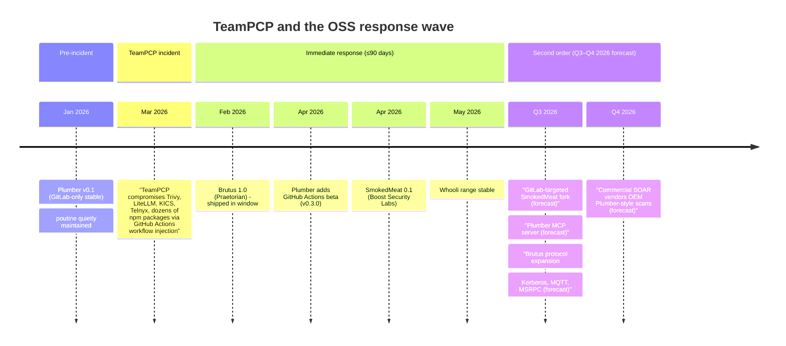

Three measurable changes that TeamPCP triggered:

| Before TeamPCP (Jan 2026) | After TeamPCP (May 2026) |
|---|---|
| CI/CD scanners: poutine, zizmor, Gato-X (3 tools, all GitHub-only) | + SmokedMeat (full kill-chain), + Plumber (compliance, GitHub+GitLab), + Whooli (deliberately-vuln org) |
| CI/CD pipeline compromise framed as "supply-chain risk" | Reframed as "tier-1 active threat" in vendor roadmaps |
| 0 OSS frameworks doing the full pipeline kill-chain | 1 — and AGPL'd to prevent fork commodification |
| No deliberately-vulnerable GitHub-org training range | Whooli, ready-to-use |

**Forecast for the next 12 months:**
1. **2–3 more incidents of TeamPCP magnitude** (probability: high). The attack surface is enormous and the defender tooling is still maturing.
2. **GitLab-targeted equivalent of SmokedMeat** ships within 6 months. Either as a GitLab provider added to SmokedMeat itself, or as a fork.
3. **Commercial CSPM vendors OEM Plumber-style scans** by Q4 2026 (probability: high). Wiz, Orca, Lacework all currently undercount CI/CD compliance in their dashboards.

---

## 9. Five forward bets — where the next high-impact OSS tooling lands

Based on the gaps surfaced across the reports under `reports/`:

| # | Predicted release | Why this gap exists | Probable origin |
|---|---|---|---|
| 1 | **OSS reachability-SCA** (call-graph + data-flow into dependencies) | All major reachability SCA today is commercial (Endor Labs, Semgrep SCA, Snyk, Mend). [`scanners.md`](./scanners.md) flags this as the open OSS-gap of 2026. | Trail of Bits (Trailmark is the precursor — already does call-graph), or OSV-Scanner team |
| 2 | **OSS WAF-bypass scanner targeting parsing-discrepancy attacks** (WAFFLED-class) | WAFFLED published 1,207 bypasses across 5 WAFs. No production scanner tests for parsing discrepancies as of May 2026. | Doyensec or NCC Group — both have the prior research |
| 3 | **HBOM-emitting firmware analyzer** (CycloneDX HBOM as native output) | CRA and CISA SBOM guidance now apply to firmware. CERT UEFI Parser emits SBOM-shaped JSON but not CycloneDX HBOM specifically. | Binarly or CMU/SEI CERT |
| 4 | **MCP-wrapped Plumber, Brutus, mquire** | All three are obvious wrap candidates. Trivy MCP is the existence proof. | Their respective vendors (r2devops, Praetorian, Trail of Bits) |
| 5 | **OSS detection-engineering "Goat" for the SOC** (deliberately-vulnerable alert sources) | Whooli proved the model for CI/CD. SOC training environments are still bespoke per team. | Splunk Boss-of-the-SOC team, or Elastic, or Allama community |

Less confident but still plausible:
- **OSS Bedrock/Agent-takedown framework** — the equivalent of SmokedMeat for AI agent supply chains. The attack research is mature (BH USA 2025 had multiple sessions); the OSS tooling lags.
- **Volatility-3 plugin port of mquire's BTF tricks for Windows** — once Microsoft ships analogous BTF-style data in Windows kernels (already in progress via `kdbgctrl`), the same architectural insight transfers.
- **Per-cloud equivalent of cloud-audit for Azure and GCP** — the IAM-escalation-graph + attack-chain-correlation approach generalizes; cloud-audit's MIT license invites forks.

---

## 10. The strategic-session synthesis

If I had to pick **one chart and one prediction** to put on a slide for executive consumption:

**The chart:** the offense/defense balance (chart 7). The defensive side has caught up on Kubernetes posture, DFIR, AppSec scanning, host firewall, and SOAR. The 5-year "OSS only ships red-team tools" complaint is no longer true; the imbalance has flipped specifically in cloud-native and pipeline-adjacent categories.

**The prediction:** **the next 12 months are dominated by integration, not novel tools.** The OSS components for an end-to-end pipeline (recon → API discovery → API authZ → CI/CD compliance → cloud posture → SIEM/SOAR → forensics) are all *available* as of May 2026. The teams that win 2026-H2 and 2027-H1 will be the ones that wire them together — typically with **DefectDojo as the system of record, Allama as the orchestrator, Buttercup/Taskflow Agent as the AI vuln-research substrate, MCP as the connective tissue**.

The conferences calendar matters less in 2027 than the **integration stories told at the conferences**. Watch for the first "we replaced our commercial SOAR with Allama + 80 integrations" RSAC keynote; that's the leading indicator of when the stack consolidates from "tools" into "platform."

---

## Methodology + caveats

- **Inventory source:** [`TOOLS.md`](../TOOLS.md), cross-checked against the report files under [`reports/`](.) and the per-conference notes under [`conferences/`](../conferences/).
- **Window:** May 2025 → May 2026 (12 months ending today, 2026-05-16).
- **Category assignment:** when a tool fits two categories (e.g., Brutus is both *credential testing* and *CI/CD post-exploitation*), I picked one for the chart. Multi-categorization would inflate bar counts.
- **Quarter assignment:** when only the year is known, I default to Q3 (DEF CON window). This explains some of the 2025-Q3 mass.
- **Vendor concentration:** counted by *primary author/org*. Joint releases are credited to the lead.
- **2026-Q2 is partial** (data through May 16). Expect ~10 more tools by July from BH USA / DEF CON 34 preview.
- **MCP detection** is binary in the inventory ("ships an MCP server or not"). Tools that *consume* MCP (Buttercup, Taskflow Agent) are not counted as "ships MCP" — the chart measures publishers, not consumers.
- The charts are regenerable: re-run [`assets/landscape/generate.py`](../assets/landscape/generate.py) after editing the `TOOLS` list at the top of that file.
