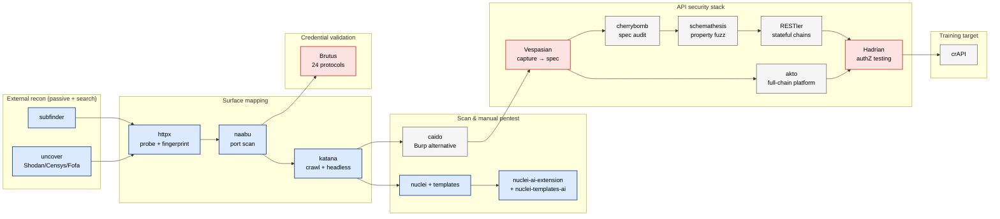
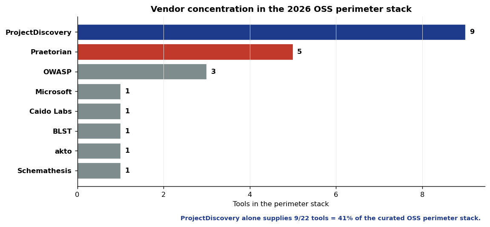
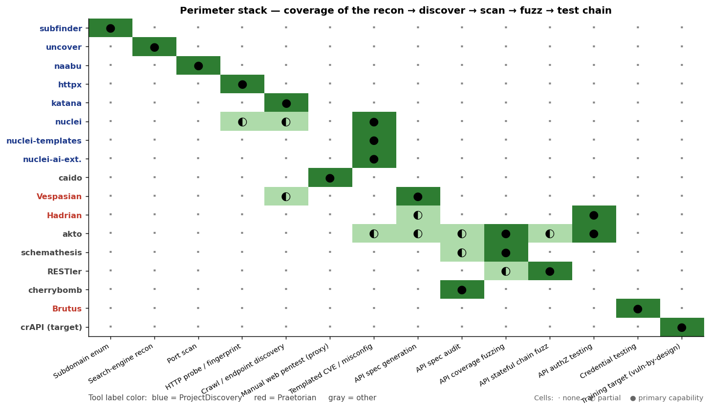
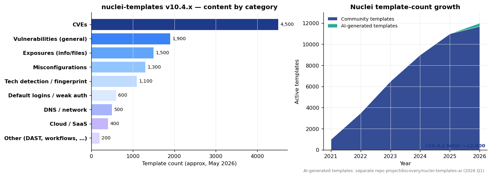
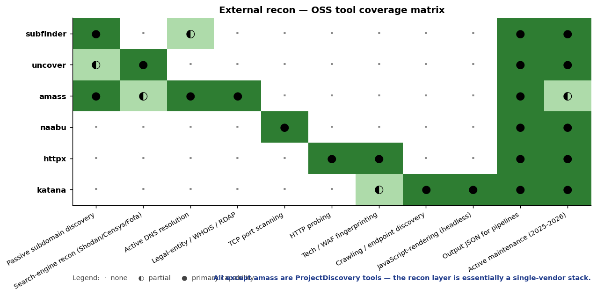

# Perimeter stack — landscape analysis

Cross-cutting analysis of the **16 OSS tools mirrored under [`../sources/perimeter/`](../sources/perimeter/)** plus the adjacent perimeter-relevant tools from `../sources/appsec/` (Vespasian, Hadrian) and the recon space outside the submodule set (amass, Pacu, others). The category split in [`../sources/perimeter/README.md`](../sources/perimeter/README.md) covers the per-tool description; this report covers the **shape of the field**.

The 12-month story is short:

1. **ProjectDiscovery built the entire recon-to-scan chain** — and now owns it.
2. **API security splintered into 5+ specialists**, each owning one workflow stage.
3. **Nuclei templates became infrastructure** — 12k+ active templates, and AI-generated templates emerged as a separate repo in 2026.
4. **Caido is the credible OSS Burp alternative**, finally — the first Rust-native fully-modern web pentest UI.
5. **Brutus closes the credential-validation gap** in the chain (already covered in [`ci-cd-security.md`](./ci-cd-security.md); included here for chain completeness).

---

## 1. The 2026 perimeter workflow chain

The canonical 2026 OSS perimeter workflow — discover → enumerate → scan → fuzz → test — is now buildable from OSS alone:

This is the chain you'd compose in 2026 if you had to build a perimeter security pipeline from OSS. The chart in §3 below quantifies which tool covers which stage; this mermaid shows the *flow*.

---

## 2. Vendor concentration — ProjectDiscovery owns ~40% of the stack

The headline: **ProjectDiscovery alone supplies 9 of 22 tools in the curated perimeter stack** — `subfinder + uncover + naabu + httpx + katana + nuclei + nuclei-templates + nuclei-ai-extension + nuclei-templates-ai`. That's **41% from a single vendor**, with the remainder split across Praetorian (5), OWASP (3), and 5 single-tool contributors (Microsoft, Caido Labs, BLST, akto, Schemathesis).

This is **structurally different from any other category in this brief**. The closest analogs are:

- **AppSec tooling**: ~22% concentrated across 5 post-engagement-OSS-pipeline orgs (see [`landscape-analysis.md`](./landscape-analysis.md) §4).
- **API security inside the perimeter chain**: ~25% concentrated in Praetorian (Vespasian + Hadrian + Julius + Brutus).

ProjectDiscovery's 41% share is the **single highest vendor concentration in the strategy session** — across any category.

**Implications:**

1. **The recon→scan chain is a single-vendor stack in practice.** If ProjectDiscovery sunsets a tool or changes a license, the chain breaks. So far they've been impeccable on this (Apache-2.0 across the board, active maintenance), but this is a real operational risk.
2. **The vendor concentration is also a UX feature.** All PD tools share output format (JSON), config (`~/.config/projectdiscovery/`), and CLI conventions — meaningful pipeline simplicity.
3. **There is no obvious second-source.** For most categories you can A/B between MIT and Apache-2.0 OSS competitors. For perimeter recon, the alternatives (amass for subdomain, masscan for port scanning, ZAP for web pentest) are *materially* older or different shape — using them means accepting friction PD's stack doesn't have.
4. **Praetorian is the natural next vendor.** Praetorian's nerva (service fingerprinting) and Brutus (credential validation) plug directly into the PD chain via JSON. The pairing `naabu | nerva | brutus` is documented in Brutus's own README. Expect more Praetorian tooling in this slot — Praetorian is positioning to be "the Praetorian half of the recon stack" alongside the PD half.

---

## 3. Chain coverage heatmap — who does what

The strong **diagonal pattern** in the heatmap is the visible proof that the perimeter tooling has consolidated into **per-stage specialists** rather than mega-tools. Reading top to bottom you can almost trace the workflow itself: subdomain enum → search-engine recon → port scan → HTTP probe → crawl → web pentest → templated CVE → API spec gen → spec audit → fuzzing → authZ → credential test → training target.

Three exceptions to the diagonal are worth pointing out:

1. **nuclei spills outward** — it does *partial* HTTP fingerprinting and crawling on its own, because templates often need light fingerprint awareness. This is why "use httpx for fingerprinting, then pipe into nuclei" is the right composition rather than "let nuclei do everything itself."
2. **akto is the only horizontal bar in the API stack** — it tries to be the full-chain platform (discovery + spec + fuzz + authZ). This is also why it's a separate buy/build decision: pick akto *or* pick the specialist chain, but mixing creates duplicate coverage.
3. **Hadrian touches "API spec generation" (◐)** — it consumes specs but doesn't generate them. It's listed as partial because the YAML-driven test definition is a sort of inverted spec.

The colors of the tool labels carry vendor information: **blue = ProjectDiscovery**, **red = Praetorian**, **gray = everything else**. The vendor structure of the stack is visible at a glance.

### Where there are no OSS contenders

The matrix also makes visible *what's missing* — stages where the OSS coverage is thin:

- **GraphQL spec audit** specifically. cherrybomb does OpenAPI; nobody does GraphQL design-flaw auditing as a primary capability.
- **gRPC fuzzing.** Hadrian tests authZ on gRPC; nothing fuzzes it.
- **WebSocket / SSE fuzzing.** Stateful WebSocket flows are an attack surface with no dedicated OSS tool.
- **Mobile API discovery.** Vespasian captures HTTP, doesn't natively handle mobile-app TLS pinning bypass + capture.

These are forward-looking opportunities. The first OSS that fills any of them inherits the diagonal slot.

---

## 4. Nuclei templates — what's in the box

**Left panel:** approximate breakdown of the ~12k active templates in `nuclei-templates v10.4.x`. CVE templates dominate (~4.5k — over a third of the corpus). General vulnerability templates (~1.9k) plus exposures (~1.5k) plus misconfigurations (~1.3k) form the bulk. Tech fingerprinting (~1.1k) is the second-largest "non-vuln" category and is what lets you pre-classify a target before running scoped CVE templates.

**Right panel:** the **growth curve from 2021 → 2026**. Templates grew at roughly 2× per year for the first three years (1k → 3.5k → 6.5k), then slowed (9k → 11k → 12k) as the **CVE backlog caught up** and net-new template authorship started to plateau. The 2026 inflection — *AI-generated templates emerging as a separate repo* (`projectdiscovery/nuclei-templates-ai`) — is the response: instead of waiting for community contributors to template every new CVE, AI generates the first-pass template, humans review, accepted templates land in the AI repo (kept separate from the community-curated main repo to avoid quality dilution).

This is a **template-as-data** pattern: the actual value of Nuclei is in the template corpus, not in the engine. The engine is small Go; the templates are the moat. ProjectDiscovery's structural advantage is that they've curated those templates for five years and have the contributor relationships to keep them flowing.

**Forecast:** by mid-2027, the AI-template repo crosses 2k templates and starts being the primary discovery surface for **newly disclosed CVEs in the first 7 days**. Community-curated templates take 2–6 weeks today; AI-generated drop to days or hours. Whichever vendor (PD or a competitor) optimizes the human-review loop wins this race.

---

## 5. Recon tools — deep comparison

A 6-tool × 11-dimension comparison of the external-recon layer:

- **subfinder, uncover, naabu, httpx, katana** — all ProjectDiscovery. Each owns 1–2 dimensions cleanly, then gets out of the way.
- **amass** — the non-PD outlier. The only tool with **legal-entity / WHOIS / RDAP recon** as a primary capability — that's amass's structural advantage from years of OWASP-driven research. It's also the only one that does *all of* passive subdomain + active DNS + WHOIS, but it pays for that breadth with a more complex CLI and slower scan times.

The right column ("Active maintenance 2025-2026") shows another asymmetry: amass is partial (the OWASP project is alive but releases are infrequent), while every PD tool is full-green (releases are frequent and predictable).

The strategic read: **amass for "deep WHOIS / legal-entity recon," PD chain for "everything else." Don't try to replace amass with subfinder + uncover; their data sources overlap but the *enrichment* amass provides (registrant relationships, organization graphs) is structurally distinct.**

---

## 6. What's *not* in this picture

Three categories of perimeter tooling intentionally excluded from this analysis:

### Mature tools deliberately not mirrored

The `sources/perimeter/README.md` already explains: **OWASP ZAP, OWASP Amass, WAF-A-MoLE, w3af, Arachni, Skipfish** — these are either 20+ years old (ZAP), narrow legacy testing (WAF-A-MoLE), or dormant. The submodule selection bias is toward "first-released or majorly rewritten in 2024-2026."

ZAP deserves a special note: it remains the **most widely-deployed OSS DAST in the world** and the **only OSS tool that's also a Burp competitor at meaningful scale**. Caido is now the credible *modern* alternative (Rust, polished UX, actively developed). The choice between them is now reasonably a choice — in 2024 it wasn't.

### Commercial tools that own the field

The OSS perimeter stack covers ~80% of the workflow but the remaining 20% is still commercial:

| Stage | Best OSS | Commercial leader |
|---|---|---|
| Full-spectrum DAST scanner | ZAP / Caido | Burp Suite Professional, Invicti |
| Bug-bounty automation | nuclei + custom workflows | Detectify, Intigriti tools |
| Continuous external attack surface mgmt (EASM) | subfinder + uncover + httpx | Wiz, Snyk EASM, RiskIQ |
| API discovery in production traffic | Vespasian (passive) | Salt Security, Noname, 42Crunch |
| WAF testing | (nothing — see [`waf.md`](./waf.md) gap analysis) | Burp + custom |

The CSPMs / EASM vendors win on **continuous monitoring + correlation dashboards**, not on detection breadth. A skilled team running the OSS chain catches more findings; a 1-person team running the CSPM catches more *consistently*. The build-vs-buy choice maps to that distinction.

### Tools not yet mirrored

Per the perimeter README's "other recent tools worth knowing about" list, ask if you want any of these added:

- `projectdiscovery/cdncheck` — CDN detection (closes a small chain gap).
- `projectdiscovery/chaos-client` — passive recon data from PD's Chaos service.
- `projectdiscovery/mapcidr` — CIDR utility for pipeline composition.
- `projectdiscovery/notify` — pipeline notification utility (Slack/Discord/email).
- `openclarity/apiclarity` (CNCF) — API observability / security in K8s service meshes.
- `snyk/agent-scan` — agent-security scanner for the AI perimeter (could move to a new `sources/ai-security/` folder).

---

## 7. Strategic synthesis

If I had to summarize the perimeter category in **three sentences**:

1. **ProjectDiscovery has won the recon → scan chain.** The 41% vendor concentration is structurally healthy because the alternative (5 vendors each owning one stage) had worse interop. The trade-off is operational risk on single-vendor dependency.
2. **API security stayed splintered, and that's also working.** Five specialists each owning one workflow stage compose cleanly via OpenAPI as the shared interface. The "one tool to do it all" entrant (akto) is viable but not dominant.
3. **The next 12 months are about closing the gaps** — GraphQL spec audit, gRPC fuzzing, WebSocket-flow testing, mobile-app TLS-pinning-bypass capture. Whoever ships the first OSS tool in any of those slots inherits a clean spot on the chain coverage heatmap with no incumbent to displace.

The **OSS perimeter stack in May 2026 is the most-complete it has ever been** — measurably so by the diagonal completeness of the chain-coverage chart. The bottleneck has shifted from "do tools exist?" to "can your team integrate and operate them?" — and that's a different problem, mostly solved by DefectDojo + Allama (see [`vulnmgmt-sbom.md`](./vulnmgmt-sbom.md) and [`defensive-ops.md`](./defensive-ops.md)).

---

## Methodology

- **Inventory source:** [`sources/perimeter/README.md`](../sources/perimeter/README.md) + cross-references to `sources/appsec/` (Vespasian, Hadrian).
- **Vendor counts** in the dominance chart: counts the *active OSS perimeter-relevant tools* per vendor — not commercial products, not unmaintained projects.
- **Nuclei template counts** in §4 are approximate (verified the 12k+ headline from the perimeter README; per-category split is my best read of `projectdiscovery/nuclei-templates` top-level directories as of May 2026). Exact counts are available via the [Nuclei template browser](https://nuclei.projectdiscovery.io/templates/).
- **Chain coverage matrix scoring** is intentionally binary-ish (`·` none / `◐` partial / `●` primary capability). Edge cases are described in the prose.
- Charts regenerable: `/tmp/stratsession-viz/bin/python3 assets/landscape/generate_perimeter.py` (the inventory lives at the top of each function in the script).
