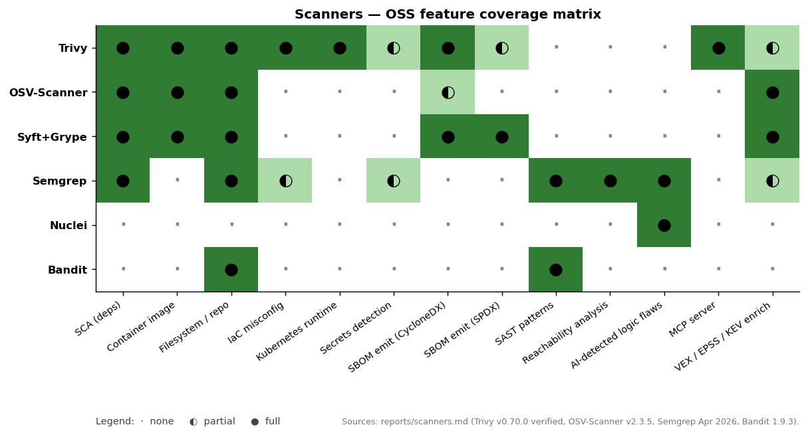

# Scanners — Trivy · Trivy MCP · Nettacker · PatchLeaks

Four scanners but they operate at three different layers: **artifact scanning (Trivy)**, **network scanning (Nettacker)**, and **patch-diff analysis (PatchLeaks)**. Trivy MCP is the agent-callable wrapper around Trivy.

| | Trivy | Trivy MCP | Nettacker | PatchLeaks |
|---|---|---|---|---|
| What it scans | Artifacts (containers, FS, repos, VMs, K8s) | Same as Trivy (via MCP) | Networks, hosts, web apps | Code diffs between two versions |
| Author | Aqua Security | Aqua Security | OWASP | hatlesswizard (independent) |
| Form factor | CLI binary + integrations | MCP server plugin | Python framework + CLI + Web UI + REST API | Go binary + web UI |
| Language | Go | Go | Python | Go (with tree-sitter via CGO) |
| LLM integration | None (deterministic) | Acts as MCP tool for LLMs | None | First-class (OpenAI/Claude/DeepSeek/Ollama) |
| Repo size | 106 MB | 628 KB | 17 MB | 2.6 MB |

These are not competitors — they're a layered stack you'd deploy together. The interesting comparison is **the role each plays in a security program**.

## Where each scanner sits in the broader OSS landscape



The matrix extends beyond the four submodule tools to the wider OSS scanner field. Three observations stand out:

1. **Trivy and Syft+Grype are the broadest** — both check 8+ categories. Trivy's edge is K8s runtime + secrets + MCP server; Syft+Grype's edge is dual-format SBOM emission (CycloneDX and SPDX).
2. **Semgrep is the only OSS scanner with reachability analysis and AI-detected logic flaws.** Both features are commercial-tier elsewhere; Semgrep ships them in the OSS tier. Pairs naturally with Trivy (which Semgrep does *not* do).
3. **Specialist scanners win narrow columns.** Nuclei is the only one running templated CVE checks against live services; Bandit is the only deep-Python SAST. Neither tries to be a general-purpose scanner — and that's the right architectural choice.

For a 2026 stack: **Trivy + Semgrep + Nuclei + (Syft+Grype if you care about SBOM distribution)** covers the matrix. OSV-Scanner is a Trivy alternative when remediation guidance matters more than secret/IaC coverage. Bandit fills the Python-deep slot if you ship Python-heavy services.

---

## Trivy — the SCA / SBOM / IaC / secret swiss army knife

The novelty isn't any one feature; it's the **scope unification.** Trivy is the *only* OSS tool that gives you all of:

| Target | What Trivy can find |
|---|---|
| Container image | OS package CVEs, application-dep CVEs, secrets, misconfigs in `Dockerfile` |
| Filesystem | Same as above, applied to a local checkout |
| Git repository (remote) | SCA + secrets without needing to clone first |
| VM image | OS packages (AMI / qcow2 / vmdk / ova / vhd) |
| Kubernetes cluster | Live workload posture (CVEs in deployed images + misconfigs in manifests + RBAC) |

What it finds at each target:
- OS packages and software dependencies in use (SBOM)
- Known vulnerabilities (CVEs)
- IaC issues and misconfigurations
- Sensitive information and secrets
- Software licenses

This is unusually broad. Most competitors are either *SCA* (Snyk, Dependabot, Mend) *or* *image* (Grype, Clair) *or* *IaC* (Checkov, kics) *or* *secret* (gitleaks, TruffleHog). Trivy is "yes all of these in one binary."

What's actually novel under the hood:

1. **Aqua's open vulnerability database (`trivy-db`)** — aggregates dozens of upstream sources (NVD, GitHub Advisory, RedHat, Alpine, Debian, Ubuntu, Oracle, Photon, Rocky, etc.) into a single bbolt-encoded DB shipped via OCI artifacts. You can host your own mirror with `oras`.
2. **Built-in support for an enormous range of package managers** — npm, pip, Cargo, Go modules, Maven, Composer, NuGet, Bundler, Yarn, pnpm, RubyGems, PHP Composer, Conan, Pub, etc. The list is essentially "any ecosystem your codebase might depend on."
3. **Native integrations matter more than the CLI** — the README lists:
   - [`trivy-action`](https://github.com/aquasecurity/trivy-action) — GitHub Actions
   - [`trivy-operator`](https://github.com/aquasecurity/trivy-operator) — Kubernetes operator that auto-scans every deployed image
   - [`trivy-vscode-extension`](https://github.com/aquasecurity/trivy-vscode-extension) — IDE integration
4. **Canary builds with every push to main** — the project ships continuous canary releases as both binaries and OCI images, on Docker Hub, GitHub Container Registry, and AWS ECR Public. Few OSS projects offer this. (Disclaimer-marked, not for prod.)
5. **K8s native** — `trivy k8s --report summary cluster` is a first-class operation. The K8s scanner consumes the running cluster's manifests + image registry data and produces a unified posture report.

The strategic point: **Trivy is the floor of cloud-native SCA**. Buy nothing else and you have a comprehensive scanner.

## Trivy MCP — the agent-callable wrapper

The Trivy MCP plugin is interesting precisely **because it's small**. 628 KB of Go for the entire plugin. It teaches the AppSec community what an "MCP wrapper around a CLI" looks like in 2026:

1. **Installs as a Trivy plugin** — `trivy plugin install mcp`. Trivy's plugin system loads the binary and exposes new subcommands.
2. **Three transports**:
   - **stdio** — default, best for direct IDE integration (VS Code, Cursor, JetBrains, Claude Desktop, Cline)
   - **streamable HTTP** — for network-attached MCP clients
   - **SSE (Server-Sent Events)** — alternative network transport
3. **The MCP tools it exposes** are functions like:
   - "scan a filesystem path"
   - "scan a container image"
   - "scan a remote repository"
   - Plus optional Aqua Platform integration for **assurance policy compliance** (commercial extension).
4. **Natural language prompt → tool call → JSON findings → LLM summarization.** A user asks "Are there any vulnerabilities or misconfigurations in this project?" Claude/Cursor calls the right Trivy MCP tool, gets structured findings back, summarizes for the human.

The novelty is **the demonstration pattern**: it's now a one-week project to MCP-wrap any structured-output CLI. Expect the same plugin shape to appear for Semgrep, Bandit, Bearer, Snyk CLI, OSV-Scanner, etc. The Aqua team built it as a precedent.

The Trivy → Trivy MCP relationship answers a strategic question: **do you wrap your scanner, or wrap your platform?** Aqua chose to wrap *the scanner directly* with no Aqua Platform dependency. The MCP server runs locally; findings stay on the local machine. Aqua Platform integration is opt-in.

## Nettacker — the OWASP DAST swiss army knife

A completely different beast from Trivy: **Nettacker is network-and-web-app DAST**, automating reconnaissance and credential testing across HTTP, FTP, SSH, SMB, SMTP, ICMP, Telnet, XML-RPC. Less novel as a tool category (many such scanners exist — Nmap, Masscan, Greenbone, ZAP), but novel in how it's organized.

What's actually distinguishing:

1. **Module-as-YAML architecture.** Every scan task — port scan, directory discovery, subdomain enumeration, credential brute force, vuln check — is a module. The framework dispatches modules in parallel; modules can be added without touching framework code. This is the "OpenVAS NVT" model done in OWASP/OSS form.
2. **Built-in scan history database with drift detection.** Nettacker stores past scans in SQLite (`.nettacker/data/nettacker.db`) and *compares* current scans to historical ones. This catches "new host appeared," "new port opened," "new subdomain registered," "new vuln matched" deltas. Most port scanners don't do this; you'd typically need a separate CMDB / asset-management layer.
3. **Three interfaces in one tool**:
   - CLI (`docker run owasp/nettacker -i 192.168.0.1 -m port_scan`)
   - REST API for programmatic integration
   - Web UI for analyst workflows (default `https://localhost:5000`)
4. **Evasion knobs built in** — configurable delays, proxy support, randomized user-agents. Most network scanners require external orchestration for this; Nettacker has flags.
5. **Multi-protocol in a single tool**, including HTTP credential brute force, SMB authentication checks, SSH/FTP/SMTP credential probing. Most competitors do one protocol.
6. **OWASP project status + Google Summer of Code participation** signals long-term maintenance.

Strategic positioning: Nettacker is the OWASP-native **bug-bounty recon / pentest automation / attack-surface-management** layer. It complements Trivy (which scans *artifacts*) by scanning *running networks and services*.

## PatchLeaks — the LLM-driven patch-diff analyzer

The most innovative of the four. **PatchLeaks does something no traditional scanner does**: it takes two versions of a codebase, diffs them, and uses an LLM to explain *why* each diff matters from a security perspective.

The use case: a CVE drops with "fixed in v2.4.5." You have v2.4.4 deployed. What did they actually fix? PatchLeaks fetches both versions (folder-to-folder, or directly from GitHub), runs a context-aware diff (tree-sitter for 11 languages), and prompts an LLM to identify which diffs look like security fixes and why.

What's actually novel:

1. **Tree-sitter for 11 languages with builtin-function detection**. PatchLeaks parses C / C++ / C# / Go / Java / JavaScript / PHP / Python / Ruby / Rust / TypeScript via tree-sitter, and for each language maintains a *builtin function index* extracted from the actual language runtime when available (CLI extraction via `php`, `python3`, `ruby`, `go`) or a comprehensive fallback list. This means PatchLeaks understands "this `strcpy()` call changed" vs. "this user function was renamed."
2. **Language-aware constructs.** PHP's `array` / `isset` / `echo` constructs, Rust macros with `!` suffix, Ruby `?` predicate methods, Python `__dunder__` methods — each is recognized as language syntax, not arbitrary identifiers.
3. **CVE matching as a comparison signal.** You can feed a CVE description into the analysis. PatchLeaks uses the LLM to check whether the discovered diff *matches* the CVE — useful for "is this the fix for CVE-2024-XXXX, or a different one?"
4. **Library mode with auto-monitoring.** Add a GitHub repo to PatchLeaks' Library, and it polls for new releases, runs the analysis automatically, and notifies on findings. A "watch repos for security-relevant changes" service in 200 lines of background processing.
5. **Multi-LLM backend.** OpenAI / Claude / DeepSeek / Ollama. Cost-conscious teams use DeepSeek or local Ollama; quality-focused teams use Claude. The same prompts work across all four.
6. **Logic-flaw detection** — the "Why PatchLeaks" table makes a strong claim: PatchLeaks catches "almost always missed" privilege-escalation / ACL / access-control logic bugs that SAST refuses to flag because the patch isn't a complete code state. The model reasons about the diff as a state transition, which traditional analyzers can't do.

The strategic point: **PatchLeaks is the operational counterpart to Watchtowr-style N-day disclosure work**. Watchtowr (see [`../blogs/attack-surface.md`](../blogs/attack-surface.md)) publishes the "here's what got fixed and how to exploit it"; PatchLeaks lets a defender or researcher do the same analysis themselves on any open-source project.

## Side-by-side: where each fits

| Question | Tool |
|---|---|
| "What's in this container image?" | Trivy |
| "Is my IaC misconfigured?" | Trivy |
| "Are my K8s workloads vulnerable in production?" | Trivy operator |
| "Let an LLM scan my code for vulns via my IDE" | Trivy MCP |
| "Find every host on this network and what's running" | Nettacker |
| "Track changes to my external attack surface over time" | Nettacker (drift detection) |
| "What did this CVE patch actually fix?" | PatchLeaks |
| "Watch upstream OSS releases for new vulns relevant to me" | PatchLeaks library mode |
| "Develop my own exploit from a patch" | PatchLeaks |

## Where this category is going

1. **MCP wrappers everywhere.** Trivy MCP is the first; expect every major scanner to ship an MCP server within 12 months. Buttercup-style CRS pipelines and Taskflow Agent-style workflows both consume these.
2. **Patch-diff analysis is the new attack-research primitive.** Combine PatchLeaks's diff understanding with Taskflow Agent's orchestration and you have an autonomous N-day discoverer. This is a year away from being deployable but the components are all open-source today.
3. **Network scanning is consolidating, not innovating.** Nettacker, Nmap, Masscan, Greenbone — incremental improvements; the field is mature. The new attack surface is *cloud control planes* (Prowler, CloudFox, KIEMPossible — see TOOLS.md), not network ports.
4. **Trivy keeps eating adjacent categories.** Each release adds another package manager, another OS, another IaC framework. Building a competitor today doesn't make sense; the right play is to *integrate with Trivy* (like Trivy MCP does), not replace it.

---

# Recent advancements & broader landscape

The four submodule tools cover only a slice of the scanner ecosystem. This section catalogs the *other* significant 2025–2026 advances and adjacent tools that any production AppSec stack should consider.

## What changed in the submodule tools specifically

### Trivy v0.70.0 (April 16, 2026) — verified from `CHANGELOG.md`

The release that the submodule pins to. Notable concrete features:

| Feature | Detail |
|---|---|
| **Python PEP 751 (`pylock.toml`) parser** | Two PRs — `#9632` and `#10137`. Trivy now understands Python's new lock-file format. Previously you needed Poetry or pip-tools metadata to scan accurately. |
| **Go `-trimpath` binary detection** | When Go binaries are built with `-trimpath` (which strips module info), Trivy now falls back to reading the **ELF symbol table** to recover version data. This closes a real coverage gap for stripped production binaries. |
| **Maven `settings.xml` proxy support** | Java/Maven scans now respect proxy config from both `~/.m2/settings.xml` and `$MAVEN_HOME/conf/settings.xml`. Important for enterprises behind proxies. |
| **Azure ARM template support** | New misconfig coverage for **Azure Kubernetes Service** (AKS) clusters defined via ARM templates, plus `azurerm_network_interface_security_group_association`. |
| **`Resource_id` resolution** | Azure resources can now be resolved via their resource ID (cross-reference in IaC). |
| **Third-party package skipping** | Trivy now uniformly skips third-party-repo packages (Docker, NVIDIA, EPEL, Remi) across all OS detectors to reduce false positives where third-party repos have their own update channels. |
| **Server version in JSON output** (client/server mode) | The client fetches `/version` and embeds in scan reports — makes air-gapped deployments easier to audit. |
| **CVSS v4 in CycloneDX output** | Outputs now include CVSS v4 ratings alongside v3. CycloneDX consumers (Sunshine, DefectDojo) can use either. |
| **`replace_all`-style misconfig ignore rule matching** | Ignore rules now case-insensitive on identifiers. Small but high-impact for teams with mixed-case rule IDs. |
| **Trivy CheckBundle excluded from `/version` endpoint** | Smaller version payload for the client. |

### Trivy MCP — submodule HEAD is `076c9b4`

Recent activity shows a small, focused plugin in active maintenance:

- **Paginated findings** (`f289f92`) — important for scans against large container images that return thousands of findings.
- **Streamable HTTP transport** (`27127b4`) — added alongside the existing stdio + SSE transports. Now three transports.
- **Assurance policies parsing fix** (`fd908ae`) — Aqua Platform plugin results were being parsed incorrectly; fixed.
- The MCP plugin tracks Trivy releases tightly — multiple commits in this window are just version bumps.

### Patch Diff Tools — PatchLeaks still single-author

PatchLeaks (HEAD `3c53291`, November 2025) hasn't seen a major release since the initial submodule snapshot. The tool's value proposition (multi-LLM patch-diff analysis with tree-sitter across 11 languages) is unique enough that there's no direct OSS competitor.

## Adjacent OSS scanners worth knowing about

### Semgrep — the SAST workhorse with 2026 AI features

Not in `sources/appsec/`, but the most-deployed pattern-based SAST tool in 2026. The April 2026 release added significant capabilities:

- **AI-powered detection (beta)** — finds business-logic flaws like IDORs and broken authorization that static patterns can't catch. Notable because most SAST tools dismiss IDOR detection as out-of-scope.
- **Autofix (beta) for Semgrep Code** — extends AI-generated draft pull requests from Supply Chain findings to Code findings. Contextual remediation guidance + breaking-change analysis in the PR body.
- **Custom Workflows** — Python-based, AI-assistant-friendly workflows for custom detection / triage / validation / remediation. Pre-built workflows for multimodal detection, AI-powered triage, autofix.
- **Cursor + Claude Code plugin** — Semgrep runs automatically on every file in your IDE for Code, Supply Chain, and Secrets findings.
- **Reachability analysis** (Semgrep's [2025 blog post](https://semgrep.dev/blog/2025/what-you-should-know-about-dependency-reachability-in-sca/)) — Semgrep argues that SCA reachability has known false-negative + false-positive issues even when implemented correctly. Worth reading before adopting any reachability-aware SCA tool.

**When Semgrep over Trivy**: SAST (source-code pattern matching) is Semgrep's home turf. Trivy does SCA, IaC, secrets, but not deep source-pattern SAST.

### Google OSV-Scanner v2.3.5 (March 2026)

**Trivy's strongest competitor in SCA.** Backed by [osv.dev](https://osv.dev), the largest aggregated open-source vulnerability database (covers NVD + GitHub Advisory + Alpine + Debian + Ubuntu + dozens of ecosystem sources).

Key v2.0+ (2025–2026) capabilities:

- **Container layer-aware scanning** for Debian, Ubuntu, Alpine. Identifies which layer introduced each package; detects base image; filters vulnerabilities unlikely to affect the running container.
- **Guided remediation engine** — analyzes the dependency graph and recommends the *minimum* upgrade set to resolve vulns, ranked by depth, severity, and "ROI." This is a feature Trivy doesn't have.
- **Transitive scanning for Python `requirements.txt`** via deps.dev API (March 2026) — indirect Python dep visibility was previously a coverage gap.
- **Interactive HTML reports** with drill-down by package, severity, fix availability.

**When OSV-Scanner over Trivy**: when remediation guidance is the bottleneck, not detection. Trivy gives you "here are CVEs"; OSV-Scanner gives you "here's the smallest upgrade that fixes them."

### Anchore Syft v1.42.0 (Feb 2026) + Grype

The dominant SBOM-generation + vulnerability-scanning pair from Anchore. Tight integration with Sunshine and DefectDojo (both ingest Syft-generated CycloneDX SBOMs).

Recent improvements:

- **20% faster scans** (Syft v1.20+) via Go 1.24 map optimizations.
- **Dedicated Bitnami cataloger** — combines authoritative Bitnami SBOMs with Syft's own analysis for the most accurate result on Bitnami container images.
- **Layer-aware Syft + Grype pipeline** — generate SBOM once, scan many times against updated vuln DBs.
- **Risk prioritization** in Grype with EPSS, KEV, and CVSS — same prioritization signals Sunshine uses.

**When Syft+Grype over Trivy**: tighter SPDX support (Trivy prefers CycloneDX); long-term Anchore-stack alignment; if you're generating SBOMs for distribution rather than scanning.

### ProjectDiscovery Nuclei v3.8.0 (April 2026)

12,000+ community templates. Complements Trivy entirely — Trivy scans artifacts, Nuclei scans **running services** for known CVE patterns + misconfigs.

2026 advances:

- **AI-powered template generation from natural language** — `nuclei -ai "find admin pages with default credentials"` generates a YAML template. Lowers template-authorship barrier dramatically.
- **PDF export for scan results** (v3.8.0).
- **XSS reflection-context analyzer** that distinguishes HTML / attribute / JS context for accurate XSS validation.
- **Honeypot detector** — deprioritizes honeypot-shaped targets to reduce noise on internet-wide scans.
- **`projectdiscovery/nuclei-templates-ai`** — separate repo of AI-generated templates for CVEs that don't yet have community-maintained templates. Coverage acceleration.

**When Nuclei over Trivy**: scanning *running* services for known CVEs (e.g., Log4j detection in a live deployment, not a container image).

### GitHub CodeQL — declarative security modeling

GitHub announced in May 2026 a major CodeQL update: **declarative security modeling** that lets engineers configure how trusted/validated data is handled **without writing custom CodeQL queries**. This is a significant lowering of the CodeQL adoption barrier (writing CodeQL queries has been the main blocker).

Background context (from the GitHub Security blog):

- GitHub uses LLMs internally to **auto-model APIs for CodeQL**, expanding sink/source coverage and reducing false negatives.
- The **Taskflow Agent** (separate project, see [`ai-vuln-research.md`](./ai-vuln-research.md)) uses CodeQL MCP tools — same direction.
- Academic work (**QLPro**) chains CodeQL static analysis with LLMs to extract taint specs, classify them, and generate scanning rules. Hint at where the field is going.

### Snyk Code + AI Security Fabric (Feb 2026)

Snyk's Feb 2026 **AI Security Fabric** announcement positioned them as an "AI security platform" across code, models, and agentic dev. Concretely:

- **Claude integration** for vulnerability discovery, prioritization, and dev-ready fixes.
- **Agent Fix** — autonomous remediation in Snyk Code with pre-screened fixes (their version of Semgrep Autofix).
- **2026 Developer Security Report** claim: **48% of AI-generated code contains vulnerabilities**. Used as marketing but the underlying study is detailed.
- **Snyk Agent Scan** (covered in `api-security.md`) — sister product for MCP / agent-skill security.

### Bandit 1.9.3 (January 2026) — the Python SAST mainstay

Python-only AST-based SAST. 47 built-in checks across 7 categories. **2026 additions**:

- **B614** — detects unsafe `torch.load()` calls (PyTorch loads pickled data by default, which can execute arbitrary code if the file is attacker-controlled).
- **B615** — flags insecure Hugging Face model downloads. Same threat model as B614, but for HF.
- **YAML-driven ignore configuration** (1.8) — per-file/per-rule ignores in YAML. Claimed 65% false-positive reduction in CI/CD.
- **Quantum-safe crypto rules preview** in Bandit 2.0 (planned).

### Bearer, OpenGrep, ggshield, gitleaks, TruffleHog

Honorable mention category. Each is the strongest OSS in its narrow niche:

- **Bearer** — SAST focused on **data flow and sensitive-data discovery**, not pattern matching. Tracks PII / PHI through code.
- **OpenGrep** — a community fork of Semgrep launched in 2025 in response to Semgrep's commercialization. Worth knowing about as a hedge.
- **ggshield / gitleaks / TruffleHog** — three competing OSS secret scanners. ggshield (GitGuardian's CLI) is the most polished commercial-OSS; gitleaks is the simplest; TruffleHog has the most detectors. Trivy includes secret scanning but the dedicated tools are deeper.

## Cross-cutting themes the scanner ecosystem is solving in 2026

### 1. Reachability analysis is the new prioritization frontier

Independent studies cite **71%–88% false positive rates** in traditional SCA scanners and **60–80% of flagged dependency vulns** in unreachable code paths. Reachability analysis (call-graph + data-flow tracing from app code into dependencies) reduces false positives by **60–95%** — *when implemented correctly*. The catch: Semgrep's [own blog](https://semgrep.dev/blog/2025/what-you-should-know-about-dependency-reachability-in-sca/) documents cases where reachability analysis produces *false negatives* (exploitable vulns hidden behind "unreachable") and *false positives* (non-exploitable findings flagged as reachable).

Vendors with reachability analysis in 2026: Endor Labs, Semgrep SCA, Snyk, Mend, Xygeni, Konvu. **No fully OSS implementation yet** — this is the next "we need an OSS version of X" opportunity in the SCA space.

### 2. EPSS + CISA KEV are mainstream prioritization signals

Sunshine, Grype, OSV-Scanner, and most commercial tools now enrich CVE findings with **EPSS (Exploit Prediction Scoring System)** and **CISA KEV (Known Exploited Vulnerabilities)** data. If your vuln-mgmt workflow still prioritizes by raw CVSS only, you are using a 2020 signal in a 2026 world.

### 3. CycloneDX is winning the SBOM format war

OWASP CycloneDX (Ecma International standard **ECMA-424**) supports SBOM, **VEX** (Vulnerability Exploitability Exchange), VDR, SaaSBOM, HBOM, AI/ML-BOM, CBOM, OBOM, MBOM. Single document carries inventory + vulnerability status. Competing formats (SPDX, OpenVEX, CSAF VEX) remain in use but CycloneDX is the most common in security tooling — both Trivy and Syft default to CycloneDX output now. Sunshine is the visualizer; CycloneDX 2.0 preview (announced at OWASP Global AppSec USA 2025) targets broader BOM types.

### 4. MCP wrappers are the standard way to integrate scanners with agents

Three independent OSS examples now: **Trivy MCP**, **Seclab Taskflow Agent's CodeQL MCP**, **Snyk Agent Scan**. The pattern is consistent: stdio transport for IDE integration, streamable HTTP for network deployment, optional SSE. Wrap any structured-output scanner in MCP in a week.

### 5. AI-assisted vulnerability detection has graduated from research

The CodeQL + LLM auto-modeling, Semgrep AI-powered detection, Snyk DeepCode AI, GitHub Security Lab Taskflow Agent, Buttercup CRS — all five are *operational*, not research. Specific patterns:

- **LLM as oracle / triage layer**, not detector: Semgrep + Snyk approach.
- **LLM as planner**, not executor: Hadrian planner approach (`--planner`).
- **LLM as auto-modeler for traditional analysis**: GitHub's CodeQL approach.
- **LLM-orchestrated multi-agent pipeline**: Buttercup approach.

The cost varies dramatically — Buttercup ran at $181/point on AIxCC; daily Semgrep AI scans on a monorepo cost double-digit dollars/day. The economics of "AI scan everything continuously" are still under negotiation.

### 6. WAF parsing-discrepancy attacks are a new attack class for scanners to detect

**WAFFLED research (arxiv 2503.10846)** demonstrated **1,207 bypasses across 5 major WAFs** by exploiting parsing discrepancies between WAF and upstream. WAFNinja, WAF-A-MoLE, WAFtester are OSS tools for testing this directly. Most production scanners (including the ones in this submodule set) **don't yet test for WAF bypasses** — this is the next coverage gap.

## Operational stack recommendation (2026)

For a 2026 scanner deployment that doesn't break the bank:

```
SBOM gen:               Syft (CycloneDX)         OR  Trivy
Container/IaC/SCA:      Trivy                    OR  OSV-Scanner (better remediation guidance)
SBOM viz:               Sunshine (with EPSS + KEV enrichment)
Vuln mgmt:              DefectDojo (system of record)
SAST:                   Semgrep                  OR  Semgrep + Bandit for Python
Secret scanning:        gitleaks                 OR  TruffleHog
Network/web scanning:   Nuclei (running services)  +  Nettacker (network enumeration)
Patch analysis:         PatchLeaks (when N-day-tracking matters)
IDE integration:        Trivy MCP + Semgrep Cursor plugin
Agent security:         Snyk Agent Scan (when MCP is in your stack)
```

These are all OSS (or have meaningful OSS tiers). Total cost for a small team: \$0 in licensing, ~2 hours/week of operator time. The cost of integration (DefectDojo + parsers + dedup tuning) is the real investment — not the scanners themselves.

The category is mature; **integration** is the new differentiator. Each scanner above does its job well; the question is whether your findings end up triaged or in a dashboard nobody opens.
