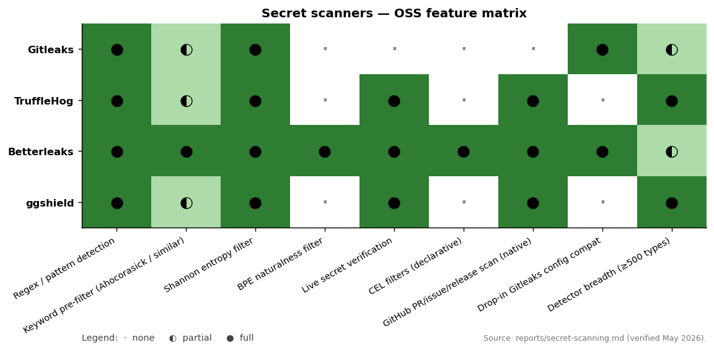

# Secret scanning — Betterleaks (vs Gitleaks / TruffleHog)

A single submodule tool: **[Betterleaks](../sources/appsec/betterleaks)** (Apr 2026), the spiritual successor to Gitleaks, written by Zach Rice (the original Gitleaks author) with funding from Aikido Security. Designed as a **drop-in replacement** for Gitleaks — existing `gitleaks` config files, ignore files, and CLI flags carry over with no modification — but with a fundamentally rethought detection engine.

This is a category most teams already have an opinion about. The right framing isn't "which secret scanner is best" — it's "what changed in the secret-scanning category between 2024 and 2026, and is it worth migrating?"

---

## What Betterleaks is

**Repo:** `betterleaks/betterleaks` · Go · maintained by the team behind Gitleaks (Zach Rice + collaborators), supported by Aikido Security. Stable release as of Apr 2026.

The pitch is in the tagline: *"Scan the world (for secrets)."* The substance is in the detection engine.

```bash
# Identical to Gitleaks for existing users:
betterleaks git /path/to/repo -v --git-workers=16
betterleaks dir /path/to/file/or/dir -v

# New surfaces:
betterleaks github https://github.com/org-or-user --include issues,prs,actions,releases,gists
betterleaks github https://github.com/org/repo/pull/113      # one PR (excludes description, scans comments)
cat some_file.txt | betterleaks stdin -v
```

Install: `brew install betterleaks` / `dnf install betterleaks` / `docker pull ghcr.io/betterleaks/betterleaks:latest` / build from source.

### What's actually novel

1. **CEL filters everywhere.** This is the biggest architectural change vs. Gitleaks. Filtering is no longer a static `[[allowlist]]` table; it's **[CEL (Common Expression Language)](https://cel.dev/) — Google's expression language used by Kubernetes admission and Envoy.** Two filter hook points:
   - **`prefilter`** — runs **before** any regex matching. Has access to a `fragment` (the data chunk being scanned) and its `attributes` (git metadata, path, author, commit message, etc.). Used to cheaply bail out: skip binary file extensions, skip `node_modules`, skip commits from `renovate[bot]`, etc.
   - **`filter`** — runs **after** a regex match candidate. Has access to `attributes` plus the candidate `finding` (e.g., `finding["secret"]`, `finding["match"]`). Used to suppress test fixtures, evaluate entropy, etc.
   
   Example `prefilter`:
   ```cel
   (matchesAny(attributes[?"path"].orValue(""), [
     r"""(?i)\.(?:bmp|gif|jpe?g|png|svg|tiff|pdf|exe)$""",
     r"""(?:^|/)node_modules(?:/.*)?$""",
     r"""(?:^|/)vendor(?:/.*)?$"""
   ]))
   || attributes[?"git.author_name"].orValue("") == "renovate[bot]"
   ```
   
   Example `filter`:
   ```cel
   (
       attributes[?"git.author_name"].orValue("") == "ci-runner" &&
       attributes[?"path"].orValue("").startsWith("mocks/") &&
       finding["secret"].contains("TESTING")
   )
   || (entropy(finding["secret"]) <= 3.0)
   ```
   
   This is **massively more expressive** than Gitleaks' `[allowlist]` patterns. The same expression language is used by Kubernetes admission, Envoy, Tekton, and now Betterleaks — analysts who learned CEL elsewhere reuse the skill.

2. **Secret validation built into the rule.** `validate = '''…'''` is a CEL expression that runs an HTTP request and classifies the secret as valid / invalid / unknown based on the response. Example for a GitHub fine-grained PAT:
   
   ```cel
   cel.bind(r,
     http.get("https://api.github.com/user", {
       "Accept": "application/vnd.github+json",
       "Authorization": "token " + secret
     }),
     r.status == 200 && r.json.?login.orValue("") != "" ? {
       "result": "valid",
       "username": r.json.?login.orValue(""),
       "name": r.json.?name.orValue(""),
       "scopes": r.headers[?"x-oauth-scopes"].orValue("")
     } : r.status in [401, 403] ? {
       "result": "invalid",
       "reason": "Unauthorized"
     } : unknown(r)
   )
   ```
   
   TruffleHog has had verification ("does this credential actually work?") since 2022 — but as a Go plugin, one per detector type. Betterleaks moves verification into the **rule definition itself**, as a CEL expression that ships with the rule. The implication: writing a custom rule and shipping a verifier for it is now a single file change.

3. **BPE-based "naturalness" filter.** The single most interesting detection-engine change. Traditional secret scanners use **Shannon entropy** as a false-positive filter ("a string with high entropy might be a secret"). Entropy is a 1948 information-theory measure of character-level randomness — it has well-known failure modes (long-but-low-entropy strings, short-but-high-entropy strings, base64 confounders).
   
   Betterleaks evaluates strings using **Byte Pair Encoding (BPE) tokenization** — the same compression technique used by GPT-class LLM tokenizers. The intuition: BPE tokenizers compress natural-language strings into few tokens (English text is heavily redundant) and compress random / "credential-shaped" strings into many tokens. The **BPE token count per character** is a much better proxy for "this looks like a non-human-readable string" than Shannon entropy.
   
   Practical consequence: dramatic reduction in **natural-language false positives** (long English error messages, README snippets, documentation). The blog post linked from the repo — "Regex is (almost) all you need" at [lookingatcomputer.substack.com](https://lookingatcomputer.substack.com/p/regex-is-almost-all-you-need) — is the detailed write-up. This is genuinely novel; the technique has been discussed academically but not shipped at this scale in OSS.

4. **GitHub-resource scanning out of the box.** `betterleaks github <url>` works against orgs, users, single PRs, single repos. `--include issues,prs,actions,releases,gists` flips on extra surfaces. Gitleaks supports this via separate `gh` tooling; Betterleaks bakes it into the binary. The "single PR scan" surface is especially useful for **post-disclosure triage** — when a vulnerability report lands, you want to scan just that PR's comments without re-scanning the whole repo.

5. **Performance defaults.** Three concrete techniques:
   - **Ahocorasick keyword pre-filtering** — before running expensive regex, check whether known keywords (`token=`, `secret=`, `ghp_`, `AKIA`, etc.) are even present in the candidate fragment.
   - **RE2 regex engine** — linear-time guaranteed, no catastrophic backtracking.
   - **Sane parallelization defaults** — `--git-workers=16` works for most repos without tuning.

6. **Drop-in compatibility with Gitleaks.** The migration path is explicit: existing `gitleaks` configs, ignore files, and CLI flags carry over. No "rewrite your rule set" cost. This is the right go-to-market for a successor tool.

### What it doesn't change

- **It's still regex-based detection.** The detection layer is regex + keywords + entropy/BPE filters. It's not a structural / semantic / ML-classifier scanner. If you want "look at the AST and figure out if this is a constant string being assigned to a sensitive variable name," that's still a Semgrep / Bearer use case.
- **It's still scope-bounded to text/files/git.** No image scanning, no Docker layer scanning, no binary scanning. Trivy does those.
- **Validation requires HTTP egress.** If you scan in an offline environment, the `validate` step won't run (regex matching still works fine).

---

## How it compares to Gitleaks, TruffleHog, ggshield



The matrix view of the comparison from later in this report: **Betterleaks owns the rule-writing column** (CEL filters + BPE naturalness + drop-in Gitleaks compat); **TruffleHog and ggshield own the detector-breadth column** (≥500 verifier types each). Gitleaks is the baseline everyone migrates from.

Practical decision rule: **Betterleaks as your pre-commit / CI gate, TruffleHog (or ggshield) for periodic full-history sweeps of the credential types that actually need rotation**. Don't pick one tool; pick the layered combination.


| Feature | Gitleaks | TruffleHog | **Betterleaks** |
|---|---|---|---|
| Regex detection | ✅ | ✅ | ✅ (RE2) |
| Keyword pre-filter | ⚠️ basic | ⚠️ basic | ✅ Ahocorasick |
| Allowlist expressiveness | TOML patterns | YAML / Go plugins | CEL (full expression language) |
| Entropy filter | ✅ Shannon | ✅ Shannon | ✅ Shannon + BPE naturalness |
| Live secret verification | ❌ | ✅ (Go detectors, ~800 verifiers) | ✅ (CEL `validate` per rule) |
| GitHub PR/issue/release scanning | via external `gh` | ✅ | ✅ baked in |
| Drop-in config compatibility with Gitleaks | n/a | ❌ | ✅ |
| Author | Original Zach Rice (left project) | TruffleSec team | Zach Rice (returned) + Aikido |
| Active development (2026) | ✅ (community) | ✅ | ✅ |

The TruffleHog vs. Betterleaks split is the interesting one:

- **TruffleHog's strength** is **breadth of verified detectors** — ~800 detectors as of 2026, each one a Go plugin that knows how to validate that specific credential type. The detector ecosystem is the moat.
- **Betterleaks's strength** is **the rule writing experience** — CEL filters + validators + naturalness scoring make a custom rule easier to write *and* less likely to fire on false positives.

The Rafter benchmark study from 2026 (linked in the web research) suggests the *practical* recommendation for most teams: **Betterleaks as a pre-commit hook and CI step, with periodic TruffleHog sweeps of your full history**. Betterleaks catches known patterns instantly with fewer false positives; TruffleHog's verifier breadth catches edge cases and tells you which detections actually need emergency rotation.

---

## Migration story

If you're currently on Gitleaks:

```bash
# 1. Install
brew install betterleaks

# 2. Try it against your existing config
betterleaks git . --config .gitleaks.toml  # works as-is

# 3. Add a CEL prefilter to skip noisy paths
# 4. Add BPE-based naturalness filter to drop FP-heavy detectors
# 5. (Optional) Add per-rule validators for the credential types you actually rotate
```

The migration is **incremental** — you can run both side by side, compare findings, then cut over. Aikido Security (Belgian app-sec platform funding the project) effectively guarantees ongoing maintenance.

If you're currently on TruffleHog: **don't migrate, augment**. TruffleHog's detector breadth is still ahead. Add Betterleaks as the fast pre-commit / CI gate; keep TruffleHog for the periodic full-history sweep.

---

## Where Betterleaks fits in the stratsession picture

Betterleaks slots into the **AppSec scanner stack** alongside Trivy (which also does secret scanning, but less deeply), the `gitleaks` install most teams already have, and the existing CI gate setup.

In the operational-stack recommendation from [`scanners.md`](./scanners.md), the line about secret scanning is:

```
Secret scanning:        gitleaks                 OR  TruffleHog
```

The 2026 update to that recommendation:

```
Secret scanning:        Betterleaks (CI / pre-commit) + TruffleHog (full-history sweep)
```

For the SmokedMeat workflow specifically (see [`ci-cd-security.md`](./ci-cd-security.md)): SmokedMeat *uses gitleaks internally with custom rules* for its private-key extraction. Knowing Betterleaks exists is useful for the defensive side — if you want to catch the same secret patterns SmokedMeat is looking for, before the secret hits the commit history, Betterleaks as a pre-commit hook is the layer.

---

## Where the category is going

1. **CEL is winning the policy-expression-language war.** Kubernetes admission, Envoy, Tekton, OPA Gatekeeper, now Betterleaks. The skill is increasingly reusable across security-adjacent tools. Worth investing in.

2. **BPE naturalness scoring is the new entropy.** Expect TruffleHog, Snyk, and ggshield to adopt similar techniques in their next major versions. Shannon entropy will become a fallback, not a default.

3. **Verification-at-rule-time is becoming the norm.** TruffleHog showed the value of verifying credentials live; Betterleaks shows the value of expressing that verification in the rule rather than as a Go plugin. Expect new tools to ship both ways.

4. **The Gitleaks → Betterleaks succession is a model.** OSS tools regularly stall when the original author leaves. The pattern of "original author returns, ships a successor as a drop-in replacement, gets commercial sponsor" is unusual and worth watching as a template for other stalled OSS revivals. (See also: the Semgrep → OpenGrep fork dynamic, which is the *opposite* shape — community fork without original author.)

5. **Aikido + Boost Security + Praetorian + Trail of Bits + GitHub Security Lab + Doyensec** are all running variations of the "consultancy / vendor → OSS post-engagement release" pipeline in 2026. The result: faster OSS velocity in security tooling than at any point in the prior decade. Betterleaks is part of that wave.
