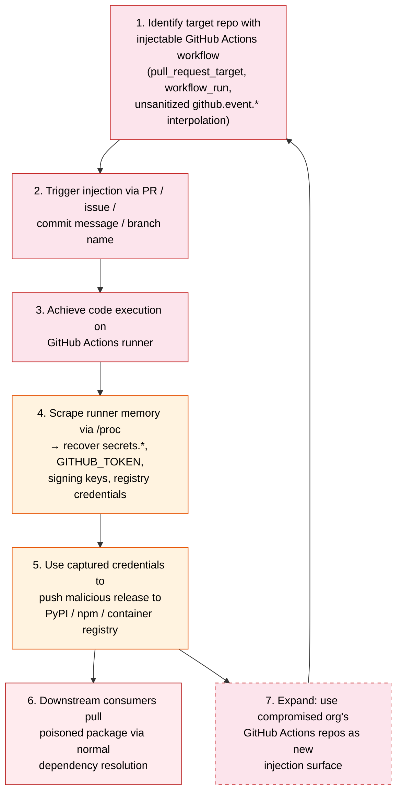
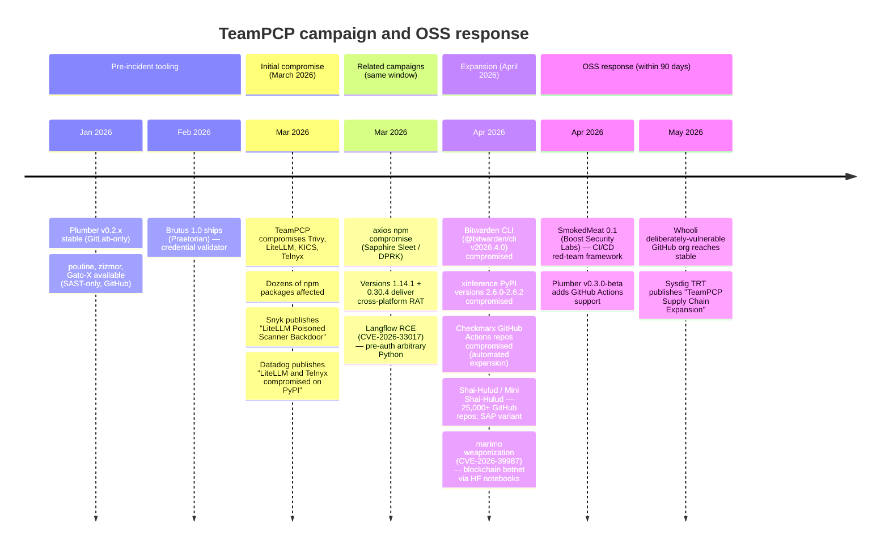

# TeamPCP post-mortem — supply-chain attack on the defender toolchain

*Incident window: March–April 2026. Synthesis compiled May 2026.*

This report reconstructs the TeamPCP campaign, documents detection gaps it exposed, catalogs the OSS response tooling that shipped within 90 days, and extracts lessons for CI/CD security posture. It draws on incident coverage scattered across [`blogs/supply-chain.md`](../blogs/supply-chain.md), [`blogs/cloud-native.md`](../blogs/cloud-native.md), [`ci-cd-security.md`](./ci-cd-security.md), and [`landscape-analysis.md`](./landscape-analysis.md). For the detailed technical analysis of each response tool, see [`ci-cd-security.md`](./ci-cd-security.md).

---

## Executive summary

TeamPCP was the most consequential open-source supply-chain attack of 2026. A single threat actor exploited GitHub Actions workflow injection to compromise the build pipelines of multiple high-profile packages — including **two security tools** (Trivy, KICS) — and used those pipelines to ship malicious updates to downstream consumers. The campaign ran from March through April 2026, expanding from its initial PyPI/npm vector to compromise the Bitwarden CLI and the xinference LLM framework before containment.

What made TeamPCP a tier-1 event was not the volume of affected packages (though that was substantial) but the *target selection*. By compromising Trivy (the most widely deployed OSS container/IaC scanner) and KICS (Checkmarx's IaC scanner), the attacker poisoned the tools defenders use to detect exactly this class of attack. Every organization running compromised Trivy in CI was simultaneously (a) exposed to the malicious payload and (b) running a scanner that could no longer be trusted to detect it.

The OSS community's response was fast and structurally sound: three purpose-built tools — SmokedMeat, Plumber, and Brutus — shipped within 90 days, covering the red-team, compliance, and credential-validation layers respectively. The gap that remains is **runtime detection** in CI/CD: the space between "SAST finds the injection pattern" and "something alerts when a compromised pipeline is actively exfiltrating."

---

## Attack chain reconstruction

The TeamPCP kill chain followed a repeatable pattern. Understanding the pattern matters more than memorizing the affected packages — the same chain applies to any GitHub Actions-dependent project.



Key observations about this chain:

1. **No zero-day required.** Every step used documented, known attack primitives. Workflow injection via `pull_request_target` and unsanitized event context interpolation have been cataloged since 2021. The novelty was in chaining them at scale and targeting security tooling specifically.

2. **The loop is self-amplifying.** Compromising one org's GitHub Actions repos (step 7) yields new injectable workflows in that org's other repos. The Checkmarx GitHub Actions repos were compromised this way — KICS was the entry point, then the attacker expanded across Checkmarx's other Actions repositories.

3. **Runner memory is the pivot.** Step 4 — scraping `/proc` for the Runner.Worker process to recover unmasked secrets — is the technique that turns a workflow injection into a full registry compromise. GitHub deliberately hides `secrets.*` values from action logs, but the values exist in runner process memory. The technique (first documented by Nord-Stream/Synacktiv) was operationalized at scale in TeamPCP.

4. **Package registries trusted the signing identity.** Once the attacker had the PyPI/npm publishing credentials from runner memory, the malicious releases were signed with the legitimate maintainer's credentials. No registry flagged the uploads as anomalous.

---

## Timeline



The April 2026 expansion phase is where TeamPCP crossed from "supply-chain incident" to "systemic threat." The Bitwarden CLI compromise put the campaign into the credential-management stack; the xinference compromise put it into the AI/ML inference stack. Both represent lateral expansion into high-trust software categories.

---

## Affected packages

| Package | Ecosystem | Maintainer/Vendor | Compromise window | Source |
|---|---|---|---|---|
| **Trivy** | Go / container images | Aqua Security | March 2026 | Sysdig TRT, Aqua blog |
| **KICS** | Go / npm | Checkmarx | March 2026 | Sysdig TRT |
| **LiteLLM** | PyPI | BerriAI | March 2026 | Snyk, Datadog |
| **Telnyx** (Python SDK) | PyPI | Telnyx | March 2026 | Datadog |
| **@bitwarden/cli** v2026.4.0 | npm | Bitwarden | April 2026 | JFrog |
| **xinference** 2.6.0–2.6.2 | PyPI | Xorbits | April 2026 | JFrog |
| Checkmarx GitHub Actions repos | GitHub Actions | Checkmarx | April 2026 | Sysdig TRT |
| Dozens of unnamed npm packages | npm | Various | March–April 2026 | Multiple |

Related campaigns in the same window (separate actors, shared attack surface):

| Campaign | Vector | Attribution | Source |
|---|---|---|---|
| **axios** npm 1.14.1 + 0.30.4 | npm package compromise → cross-platform RAT | Sapphire Sleet (North Korea) | Datadog, Snyk |
| **Shai-Hulud / Mini Shai-Hulud** | Self-propagating GitHub repo worm; SAP-targeted variant | Unknown | Sysdig TRT, Wiz |
| **langflow** CVE-2026-33017 | Pre-auth RCE → arbitrary Python execution | Opportunistic | Sysdig TRT |
| **marimo** CVE-2026-39987 | Weaponized HuggingFace notebooks → blockchain botnet | Unknown | Sysdig TRT |

The temporal clustering is not coincidental. The March–April 2026 window saw a convergence of supply-chain campaigns across ecosystems. Whether this reflects shared TTPs, copycat behavior after TeamPCP's initial success, or coordinated activity is unresolved.

---

## Why this was a tier-1 event

Most supply-chain attacks compromise application libraries. TeamPCP compromised **security scanners** — the tools that organizations run *specifically to detect supply-chain compromise*. This created a recursive trust failure:

1. **Trivy is the most widely deployed OSS vulnerability scanner.** It runs in CI/CD pipelines across millions of repositories. Organizations that run Trivy to scan their container images and IaC templates were pulling a compromised scanner. The scanner itself became the attack vector.

2. **KICS is Checkmarx's IaC scanner.** Checkmarx is a commercial AppSec vendor; KICS is their OSS offering. Compromising KICS meant the attacker was inside the toolchain of organizations that *specifically invest in application security*.

3. **The attacker expanded through the compromised org's own infrastructure.** After KICS, the attacker moved laterally into other Checkmarx GitHub Actions repositories. This is the "self-amplifying loop" in the attack chain diagram — compromising a security vendor's CI/CD gives access to *all of that vendor's other projects*.

4. **Trust cascades downstream.** When a security vendor's scanner is compromised, every downstream consumer has to answer: "Was the scan result I got last week from the real scanner, or from the compromised one?" This is a fundamentally harder remediation question than "was this library version malicious?" because it retroactively invalidates security decisions made based on those scan results.

The strategic framing from SmokedMeat's README captures it precisely: *"This isn't an EDR evasion tool. It's a demonstration framework that shows how deep a CI/CD compromise goes before anything triggers an alert."* ([`ci-cd-security.md`](./ci-cd-security.md) line 84)

---

## Detection gaps exposed

TeamPCP revealed five specific detection gaps in the standard CI/CD security posture:

### 1. No runtime monitoring of CI runner processes

GitHub Actions runners execute workflow steps in an environment where `/proc` is readable. The attacker scraped the Runner.Worker process memory to extract unmasked secrets. No standard monitoring tool watches for anomalous `/proc` access patterns on CI runners. The runner is treated as an ephemeral, trusted compute environment — which it is, until the workflow it executes is injected.

### 2. Workflow injection is a SAST problem with no runtime complement

Tools like poutine and zizmor can statically detect injection-vulnerable workflow patterns (`pull_request_target` triggers, unsanitized `${{ github.event.* }}` interpolation in `run:` blocks). But static analysis only helps if it runs *before* the vulnerable workflow is exploited. TeamPCP targeted workflows that were already deployed and had been injectable for months or years. The gap: no equivalent of "runtime detection" for workflow execution — nothing that watches a running workflow and alerts when it deviates from its expected behavior.

### 3. Registry uploads from compromised credentials look legitimate

Package registries (PyPI, npm) authenticate publishers by credential, not by behavioral baseline. A malicious upload signed with the legitimate maintainer's stolen credentials is indistinguishable from a normal release. There is no "this package was published from a CI runner that was executing an injected workflow" signal available to the registry.

### 4. OIDC token exchange pivots are invisible to cloud security

SmokedMeat's documentation catalogs four OIDC pivot paths from a compromised GitHub Actions runner: AWS `sts:AssumeRoleWithWebIdentity`, GCP Workload Identity Federation, Azure AAD, and Kubernetes service accounts. These pivots use legitimate, configured trust relationships. Cloud security tools see a valid OIDC token exchange; they have no reason to flag it. The runner was *supposed* to assume that role — the problem is that the workflow running on the runner is not the one that was supposed to be running.

### 5. Cache poisoning leaves no forensic trail

The GitHub Actions Cache API allows workflows to write and read cached artifacts keyed by branch, OS, and hash. A compromised workflow can poison a cache entry; subsequent runs of legitimate workflows on the same repo will consume the poisoned cache. The Cache API does not log the content of cached artifacts, and cache invalidation is based on key match, not content integrity. SmokedMeat includes a cache-poisoning wizard that automates key prediction and staged payload injection ([`ci-cd-security.md`](./ci-cd-security.md) lines 63–64).

### What defenders should be monitoring

| Signal | Where to look | Current tooling |
|---|---|---|
| Anomalous `/proc` reads in CI runners | Runner syslog / eBPF on self-hosted runners | None standard; Falco rules could be adapted |
| Workflow execution deviating from baseline | GitHub audit log + workflow run metadata | No OSS tool does this today |
| Unusual package registry publish patterns | Registry API logs, Sigstore transparency log | Datadog "dependency cooldowns" pattern |
| OIDC token exchange from unexpected workflow | Cloud trail logs (CloudTrail, GCP audit) cross-referenced with GitHub workflow run ID | Manual correlation only |
| Cache writes from PRs targeting protected branches | GitHub Actions Cache API audit (not currently exposed) | Not available |

---

## The defensive stack as it stands (May 2026)

The OSS response to TeamPCP produced a layered defensive stack. Each tool covers a different phase of the problem. For detailed technical analysis of each, see [`ci-cd-security.md`](./ci-cd-security.md).

### Static analysis (pre-incident)

| Tool | What it does | Provider coverage | Maintainer |
|---|---|---|---|
| **poutine** | CI/CD pipeline SAST — finds injection vulns, dangerous triggers, unsafe checkout | GitHub Actions | Boost Security Labs |
| **zizmor** | GitHub Actions SAST — focused, fast, single-purpose | GitHub Actions | William Woodruff |
| **Gato-X** | GitHub Actions enumeration and abuse toolkit | GitHub Actions | Adnan Khan |
| **Plumber** v0.3.0 | CI/CD compliance scanner — Rego policy engine over pipeline + repo settings, PBOM + CycloneDX output | GitLab CI + GitHub Actions | r2devops / getplumber |

poutine and zizmor would have detected the injectable workflow patterns exploited by TeamPCP — but only if they were running against the target repositories before the attack. Plumber adds the repository-settings layer (branch protection, force-push rules, GITHUB_TOKEN permission scope) that pure SAST misses.

### Red-team validation (exercise)

| Tool | What it does | Maintainer |
|---|---|---|
| **SmokedMeat** | Full CI/CD kill-chain framework — recon (embedded poutine), 5 delivery methods, `/proc` secret scrape, OIDC pivots, cache poisoning, persistent attack graph | Boost Security Labs |
| **Whooli** | Deliberately-vulnerable GitHub org — training range for SmokedMeat operators | Boost Security Labs |

SmokedMeat is the tool that answers "could TeamPCP happen to us?" It implements the full attack chain documented above, scoped to GitHub Actions. The Whooli range provides a safe environment to run the exercise without targeting production infrastructure.

### Post-compromise credential validation

| Tool | What it does | Maintainer |
|---|---|---|
| **Brutus** | Multi-protocol credential validator (24 protocols), embedded SSH bad-key collection, pipeline-native JSON I/O | Praetorian |

Brutus answers the blast-radius question: after secrets are extracted from a compromised runner, where do they work? The `naabu | nerva | brutus` pipeline tests captured credentials against network services at scale.

### Operational composition

The three layers compose into a single assessment workflow documented in [`ci-cd-security.md`](./ci-cd-security.md) lines 198–214:

```
SAST recon               Red-team validation              Compliance gates
──────────               ───────────────────              ────────────────
poutine / zizmor    ──►  SmokedMeat full chain    ◄──►   Plumber
                         ├── Whooli range                 ├── PBOM + CycloneDX
                         ├── LOTP payloads                └── Merge-request comments
                         ├── Cache poisoning
                         ├── Memory secret scrape
                         ├── OIDC cloud pivot
                         └── Captured creds
                                 ↓
                            Brutus (validate at scale)
                                 ↓
                            Findings → DefectDojo
```

---

## Lessons learned

### 1. Workflow injection is a solved detection problem, not a solved prevention problem

The SAST tooling (poutine, zizmor) can identify injectable workflows with high accuracy. The problem is adoption and enforcement: as of May 2026, the majority of GitHub Actions workflows in public repositories have never been scanned by any of these tools. Detection at rest is necessary but not sufficient — the gap is detection at execution time.

### 2. The attack surface taxonomy for CI/CD is now documented

SmokedMeat's implementation and the LOTP catalog ([boostsecurityio.github.io/lotp](https://boostsecurityio.github.io/lotp/)) together provide the most complete public taxonomy of CI/CD attack primitives:

- **Workflow injection** — unsanitized event context in `run:` blocks, `pull_request_target` triggers
- **Cache poisoning** — predictable cache keys, no content integrity verification
- **LOTP (Living Off The Pipeline)** — code execution via build-tool config files (npm `preinstall`, pip `setup.py`, cargo `build.rs`, Makefile recipes, etc.) — 15 build tools cataloged
- **OIDC token exchange pivots** — AWS STS, GCP WIF, Azure AAD, Kubernetes SA
- **`/proc` memory scraping** — runner process memory contains unmasked secrets
- **SSH deploy-key probing** — test captured keys against org repos
- **GitHub App PEM → installation-token exchange** — escalate from a leaked PEM to org-wide access

This taxonomy is what a threat model for CI/CD pipelines should be built against.

### 3. Security tools are high-value supply-chain targets

TeamPCP demonstrated that compromising a security scanner has multiplicative impact: the malicious payload reaches every CI/CD pipeline that runs the scanner, and the scanner's own integrity is undermined. Security tools should be held to a *higher* supply-chain security standard than application libraries, not the same standard.

Concrete implications:
- Pin security-tool versions by SHA, not by tag
- Verify provenance (Sigstore, SLSA attestation) on every scanner update
- Run scanners in isolated environments where `/proc` access can be monitored
- Treat scanner-update pipelines as critical infrastructure

### 4. "Dependency cooldowns" should be standard practice

Datadog Security Labs' "dependency cooldowns" recommendation ([`blogs/cloud-native.md`](../blogs/cloud-native.md) line 84) — delaying adoption of new package versions by a configurable window — would have limited TeamPCP's blast radius. Organizations that consumed Trivy or LiteLLM updates with a 48-hour delay would have had time to learn about the compromise before their pipelines pulled the malicious versions.

### 5. Self-hosted runners need runtime monitoring

GitHub-hosted runners are ephemeral and outside the consumer's control. Self-hosted runners are persistent and *within* the consumer's control — but most organizations treat them as unmonitored infrastructure. At minimum, self-hosted runners should have:
- eBPF-based process monitoring (Falco, Tetragon) configured with CI-specific detection rules
- `/proc` access auditing
- Network egress monitoring scoped to the runner's expected communication patterns
- Filesystem integrity monitoring on the runner workspace

---

## What's still missing

### GitLab-side equivalents

SmokedMeat targets GitHub Actions exclusively. Plumber is GitLab-first but only covers compliance (static analysis of pipeline config + repo settings), not the full attack chain. There is no OSS tool that does for GitLab CI what SmokedMeat does for GitHub Actions: recon, injection, secret extraction, cloud pivots. [`landscape-analysis.md`](./landscape-analysis.md) (line 253) forecasts a GitLab-targeted SmokedMeat equivalent within 6 months — either as a GitLab provider added to SmokedMeat itself, or as a fork.

### MCP wrapping for CI/CD tools

None of SmokedMeat, Plumber, or Brutus ship MCP servers. The Trivy MCP server (Aqua, 2026-Q1) is the existence proof that wrapping a security CLI in MCP is a one-week effort. [`landscape-analysis.md`](./landscape-analysis.md) (line 232) and [`ci-cd-security.md`](./ci-cd-security.md) (line 232) both predict Plumber-as-MCP and Brutus-as-MCP by Q3 2026. SmokedMeat itself will likely stay human-driven — red-team C2 frameworks are operator-interactive by design.

MCP wrapping matters because it determines whether these tools show up in agentic security workflows (Buttercup CRS pipelines, Seclab Taskflow Agent loops, IDE-embedded analyst workflows). A scanner without an MCP interface is invisible to the emerging agentic stack.

### Runtime detection for CI/CD

This is the largest structural gap. The current tooling stack is:

```
SAST (before execution)  ─────────  [GAP]  ─────────  Post-compromise (after execution)
poutine, zizmor, Plumber             ???               SmokedMeat findings, Brutus validation
```

The gap in the middle is **runtime detection during CI/CD execution**: something that monitors a running pipeline and alerts when behavior deviates from the expected pattern. This would include:
- Anomalous process execution in workflow steps
- Unexpected network connections from runners
- `/proc` access patterns inconsistent with the declared workflow
- Cache API writes that don't match expected cache-key patterns
- OIDC token requests to unexpected identity providers

No OSS tool fills this gap today. The closest analogs are eBPF-based runtime monitors (Falco, Tetragon) deployed on self-hosted runners, but these require manual rule authoring for CI-specific patterns. The predicted convergence point is a Falco/Tetragon policy pack specifically tuned for CI/CD runner workloads.

### Detection engineering for CI/CD as a discipline

"CI/CD detection engineering" does not exist as a named practice the way "cloud detection engineering" or "endpoint detection engineering" does. There are no shared rule repositories, no common alert taxonomies, no CI/CD-specific MITRE ATT&CK mappings (the closest is the [OWASP CICD-SEC](https://owasp.org/www-project-top-10-ci-cd-security-risks/) top 10, which is a risk list, not a detection framework). Building this discipline is the multi-year project that TeamPCP made urgent.

---

## Forecast

[`landscape-analysis.md`](./landscape-analysis.md) (line 252) predicts **2–3 more incidents of TeamPCP magnitude in 2026**, grounded in:

1. **The attack surface is enormous and growing.** GitHub Actions alone has millions of workflows, many with injectable patterns that predate any SAST coverage.
2. **The defender tooling is still maturing.** SmokedMeat shipped in April 2026; most organizations haven't run it yet. The gap between "tooling exists" and "tooling is deployed" is measured in quarters.
3. **The economic incentive is proven.** TeamPCP demonstrated that a single actor can compromise high-value targets (security tools, credential managers, AI frameworks) through CI/CD injection without needing a zero-day. The ROI for attackers is clear.

Additional forecasts:

| Prediction | Timeframe | Confidence | Source |
|---|---|---|---|
| GitLab-targeted SmokedMeat equivalent | Within 6 months of May 2026 | High | [`landscape-analysis.md`](./landscape-analysis.md) line 253 |
| Plumber MCP server + Brutus MCP server | Q3 2026 | High | [`ci-cd-security.md`](./ci-cd-security.md) line 232 |
| Commercial CSPM vendors OEM Plumber-style CI/CD scans | Q4 2026 | High | [`landscape-analysis.md`](./landscape-analysis.md) line 254 |
| Whooli-style deliberately-vulnerable orgs from 2–3 other vendors | 2026–2027 | Medium | [`ci-cd-security.md`](./ci-cd-security.md) line 231 |
| CI/CD-specific Falco/Tetragon policy packs | 2026-H2 | Medium | Inferred from gap analysis |
| Package registries add behavioral baselines for publish patterns | 2027 | Medium | Inferred from detection gap analysis |

---

## Cross-references

| Topic | Report |
|---|---|
| SmokedMeat / Plumber / Brutus technical deep-dive | [`ci-cd-security.md`](./ci-cd-security.md) |
| Mermaid timeline, before/after comparison, forecasts | [`landscape-analysis.md`](./landscape-analysis.md) lines 220–256 |
| JFrog, Snyk, Semgrep blog coverage of campaigns | [`blogs/supply-chain.md`](../blogs/supply-chain.md) |
| Sysdig TRT, Datadog, Wiz incident write-ups | [`blogs/cloud-native.md`](../blogs/cloud-native.md) |
| Trivy MCP as MCP-wrapping existence proof | [`scanners.md`](./scanners.md) |
| Executive summary reference | [`README.md`](../README.md) line 19 |
